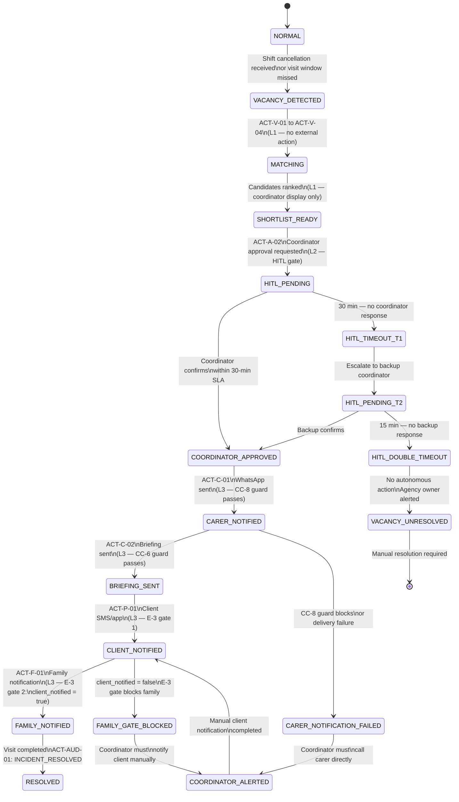

# Extracted from: akshayyelne/Home-Care-AI-Product-Management/.claude/skills/Discovery/Artifact_10_Agentic_Safety_Discovery.md
# Generated: 2026-07-31T00:49:45.112Z

**Project:** Home-Care-AI
**Stage:** Discovery → Stage 4 (Risk & Ethics Gating)
**Skill:** agentic-safety-discovery
**Date:** 2026-03-26
**Updated:** 2026-03-27 — Three new findings backported from Artifact 16 (Compliance Privacy Audit): G-CC-1 (§5A), G-DS-05 (§5C), SC-07 (§9)
**Methodology:** Level 1 (Informer) / Level 2 (Verifier) / Level 3 (Escalator); Fallback Protocol + False Positive cost for every Level 3 action
**Input:** Artifact 9 — Ethics & Trust Map (notification routing rules §5, feature clearance §7, compound combinations §4); CLAUDE.md Article VIII Agentic Control Matrix
**Regulatory Context:** Australian Privacy Act 1988 (APP). HIPAA-grade security applied as design floor.
**Feeds into:** Artifact 11 — Brainstorm Experiments (Skill 11); `agentic-logic-spec` (Execution Plugin)


> **Purpose of this artifact:** Every action the AI agent can take must be classified before a single line of logic code is written. An unclassified action is an uncontrolled action. This artifact answers: for each thing the system *does*, what is the autonomy level, who must approve it, what happens if they don't, and what does a false positive cost?


| Level | Name | Definition | HITL Required | Reversibility |
|---|---|---|---|---|
| **Level 1** | Informer | Passive observation, computation, or notification. No external commitment created. | No | Fully reversible (display only) |
| **Level 2** | Verifier | Generates a recommendation or draft action. Requires human confirmation before the action executes. Borderline signals or moderate-consequence actions. | Yes — gates execution | Reversible before confirmation |
| **Level 3** | Escalator | Executes an irreversible or high-consequence external action. Creates a real-world obligation (message sent, assignment committed, record modified). | Mandatory HITL approval | Irreversible after execution |


*All actions the system can autonomously take, classified by autonomy level. Sources: Artifact 5 (OST solutions), Artifact 6 (Top 5 features), Artifact 9 (notification routing rules).*


### 2A — Vacancy Detection & Matching

| Action ID | Action | Level | Rationale | HITL Gate |
|---|---|---|---|---|
| **ACT-V-01** | Detect unconfirmed visit slot (shift cancellation received or visit not started within window) | 🟢 L1 Informer | Pure event detection; no external action taken; purely observational | None |
| **ACT-V-02** | Run SPP-weighted match algorithm against available carers | 🟢 L1 Informer | Computation only; result not surfaced externally; coordinator is sole recipient | None |
| **ACT-V-03** | Compute proximity score per candidate (suburb postcode → client suburb) | 🟢 L1 Informer | Derived from self-reported postcode (S-3); no GPS; Green zone data only | None |
| **ACT-V-04** | Rank candidates by composite SPP match score | 🟢 L1 Informer | Internal ranking; no external communication; reversible at any point | None |
| **ACT-V-05** | Push vacancy alert to coordinator ("Vacancy detected — review now") | 🟢 L1 Informer | Notification only; no action committed; coordinator has full control | None |
| **ACT-V-06** | Display ranked shortlist in coordinator UI with match scores | 🟢 L1 Informer | Display only; coordinator not yet committed to any candidate | None |
| **ACT-V-07** | Surface match explanation to coordinator (which SPP tags drove score) | 🟢 L1 Informer | Coordinator-facing only. **CC-6 constraint applies:** match explanation (A-2) must never appear in carer notification or family notification payload. Internal display only. | None |


### 2B — Coordinator Approval Flow (HITL Gate)

| Action ID | Action | Level | Rationale | HITL Gate |
|---|---|---|---|---|
| **ACT-A-01** | Present 3-Tap Approval interface to coordinator | 🟢 L1 Informer | Interface presentation only; no action until tap 3 | None |
| **ACT-A-02** | Request coordinator to confirm replacement carer selection | 🟡 L2 Verifier | Coordinator decision required before any external action. This is the primary HITL gate for the entire downstream action chain. | Coordinator must tap "Confirm" — system waits |
| **ACT-A-03** | Record coordinator approval decision (coordinator_id + timestamp + candidate_id) | 🟢 L1 Informer | Immutable audit record of human decision; no external action | None |
| **ACT-A-04** | Coordinator overrides AI ranking (selects non-top candidate) | 🟢 L1 Informer | Override is a coordinator decision; system records it; no resistance or friction permitted | None |


### 2C — Carer Assignment (Level 3 — Coordinator Approval Required)

| Action ID | Action | Level | Rationale | HITL Gate | Fallback | False Positive Cost |
|---|---|---|---|---|---|---|
| **ACT-C-01** | Send WhatsApp assignment message to confirmed replacement carer | 🔴 L3 Escalator | External, irreversible message. Carer receives a job offer and may accept or decline. Creates real-world scheduling commitment. Cannot be unsent. **CC-8 applies:** Green data only (carer first name, client suburb, visit time, match score). | `coordinator_approved = true` **AND** `candidate_id` confirmed in ACT-A-02 | If coordinator does not approve within SLA → escalate to backup coordinator (see §3 HITL Timeout). If no approval → no message sent. Vacancy remains open. | **High.** Wrong carer assigned → unfamiliar person arrives at vulnerable senior's home. Client distress, potential refusal of entry (P-6 risk). Carer's day disrupted unnecessarily. |
| **ACT-C-02** | Send carer pre-visit briefing notification | 🔴 L3 Escalator | External, irreversible message. Briefing reveals structured SPP fields (entry protocol, personal sensitivities — P-5 phrased as operational guidance only). **CC-6 applies:** match explanation (A-2) must NOT appear. P-2 (gender preference) must NOT appear. | `ACT-C-01 complete` (carer assignment confirmed) | If ACT-C-01 failed, briefing is not sent. | **High.** Wrong briefing → carer arrives unprepared. Correct briefing sent to wrong carer → SPP data disclosed to unauthorised recipient. |


### 2D — Client Notification (Level 3 — E-3 Gate)

| Action ID | Action | Level | Rationale | HITL Gate | Fallback | False Positive Cost |
|---|---|---|---|---|---|---|
| **ACT-P-01** | Send client notification ("Your visit today will be with [first name]") | 🔴 L3 Escalator | External, irreversible notification to vulnerable senior. Incorrect notification → client confusion and anxiety, especially for familiarity-threshold clients (P-3). First in E-3 notification chain — must precede family notification. | `coordinator_approved = true` **AND** `ACT-C-01 complete` | If client notification channel unavailable (no app/SMS enrolment), log `CLIENT_NOTIFICATION_UNAVAILABLE` and proceed — client_notified flag set to `false`. Family notification must NOT proceed. | **High.** Wrong carer's name → client refuses entry or is distressed by unexpected visitor. Missed notification → client has no warning, increases risk for dementia clients (P-3/P-4). |
| **ACT-P-02** | Update client's SPP continuity history with new visit record | 🟡 L2 Verifier | Modifies a persistent client record (P-7 + P-8 binary). Yellow zone data. Coordinator review required if it contradicts existing record. | `ACT-C-01 complete` **AND** `visit completed` (post-visit trigger) | If visit did not occur (carer cancelled, client refused), SPP update is suppressed. No counterfactual added. | **Medium.** Incorrect continuity record → distorted familiarity scores in future matching. Adds noise but not immediately harmful. |


### 2E — Family Notification (Level 3 — E-3 Double Gate)

| Action ID | Action | Level | Rationale | HITL Gate | Fallback | False Positive Cost |
|---|---|---|---|---|---|---|
| **ACT-F-01** | Send family notification ("Replacement carer arranged for [client first name]'s visit") | 🔴 L3 Escalator | External, irreversible message. E-3 structural gate: family is **never** first. Violating this is the Arthur Kovacs failure case — family in panic before client knows. **CC-8 applies if WhatsApp:** Green data only. | `coordinator_approved = true` **AND** `client_notified = true` (or `client_notification_preference = family_first` with recorded explicit consent) | If client_notified = false and no family-first preference recorded: family notification is **suppressed**. Log `FAMILY_NOTIFICATION_SUPPRESSED_E3_GATE`. Alert coordinator. | **Critical (trust-destroying).** Family notified before client → family calls client in panic. Client feels surveilled, not cared for. This is the exact Arthur Kovacs complaint (SR-002). Destroys trust in the product with the entire family unit — a multi-stakeholder loss. |


### 2F — Compliance Monitoring

| Action ID | Action | Level | Rationale | HITL Gate |
|---|---|---|---|---|
| **ACT-CM-01** | Flag overdue care plan review (A-3) | 🟢 L1 Informer | Coordinator-facing only; display alert; no external action | None |
| **ACT-CM-02** | Flag expired carer credential (A-3) | 🟢 L1 Informer | Coordinator-facing only; display alert; prevents expired carer appearing in match candidates | None |
| **ACT-CM-03** | Suppress expired-credential carer from shortlist | 🟢 L1 Informer | Automatic filter — not a punitive action; carer is not notified; coordinator is informed | None |
| **ACT-CM-04** | Escalate unresolved compliance item to agency owner | 🟡 L2 Verifier | Higher-consequence action (escalates above coordinator); requires coordinator inaction for defined SLA before triggering | `compliance_sla_expired = true` (coordinator did not act within window) |
| **ACT-CM-05** | Lock coordinator from approving an assignment involving an expired-credential carer | 🟡 L2 Verifier | UI-level enforcement gate; coordinator cannot bypass without explicit override acknowledgement; override is logged | Coordinator must acknowledge override with reason |


### 2G — SPP Management

| Action ID | Action | Level | Rationale | HITL Gate |
|---|---|---|---|---|
| **ACT-S-01** | Pre-populate familiarity history from past visit records | 🟢 L1 Informer | Computation from Green data (P-7 visit log); coordinator reviews before SPP is published | None (but coordinator review recommended before activation) |
| **ACT-S-02** | Suggest SPP field update to coordinator (new pattern observed) | 🟢 L1 Informer | Suggestion only; no write occurs; coordinator decides | None |
| **ACT-S-03** | Write coordinator-confirmed SPP update to client record | 🟡 L2 Verifier | Persistent modification of Yellow-zone client record; requires coordinator explicit confirmation | Coordinator must confirm each field update |
| **ACT-S-04** | Calculate SPP completeness score (P-10) | 🟢 L1 Informer | Aggregate metadata; no individual field content; operational dashboard only | None |


### 2H — System & Audit

| Action ID | Action | Level | Rationale | HITL Gate |
|---|---|---|---|---|
| **ACT-AUD-01** | Write immutable audit log entry (APPAuditLogEntry) | 🟢 L1 Informer | Mandatory for every state transition; append-only; no HITL required; automated by design | None — this action must NEVER be gateable or defeatable |
| **ACT-AUD-02** | Generate audit report for agency owner / regulatory review | 🟢 L1 Informer | Read-only; no modification; access-controlled | None |
| **ACT-AUD-03** | Mark incident as RESOLVED | 🟡 L2 Verifier | Closes the state machine for a vacancy incident; should not self-close without coordinator confirmation | Coordinator confirmation required |


*Adapted from CLAUDE.md Article VIII for the home care scheduling context. Unlike clinical emergency dispatch, the vacancy workflow is time-critical (visit is hours away) but not life-critical. Timeouts trigger escalation, not auto-dispatch.*

```
ACT-A-02: Coordinator approval requested
    │
    ├── Coordinator responds within SLA (30 min)
    │       → Confirm or Override → ACT-C-01 executes → continue flow
    │
    └── Coordinator timeout (30 min)
            │
            → Log HITL_TIMEOUT (coordinator tier)
            → Push escalation alert to backup coordinator / agency owner
                    │
                    ├── Backup responds within SLA (15 min)
                    │       → Confirm → ACT-C-01 executes
                    │
                    └── Backup timeout (15 min)
                            │
                            → Log HITL_DOUBLE_TIMEOUT
                            → Log VACANCY_UNRESOLVED
                            → Alert agency owner: "Vacancy unresolved — manual action required"
                            → System takes NO autonomous action
                            [No auto-dispatch of carer without human approval — safety default]
```

**Critical distinction from clinical emergency protocol:** In the clinical domain, HITL double-timeout → auto-dispatch (EMS) because inaction costs a life. In the matching domain, HITL double-timeout → no action + escalation alert, because auto-assigning a carer to a vulnerable senior without any human approval is a higher risk than a missed visit. The agency must resolve the vacancy through manual means.

### HITL SLA Register

| Action | Tier 1 HITL | SLA | Timeout Consequence | Tier 2 HITL | SLA | Double Timeout Consequence |
|---|---|---|---|---|---|---|
| ACT-A-02 (coordinator approval) | Coordinator | 30 min | HITL_TIMEOUT + escalate | Backup coordinator / agency owner | 15 min | HITL_DOUBLE_TIMEOUT + VACANCY_UNRESOLVED — no autonomous action |
| ACT-CM-04 (compliance escalation) | Coordinator | Defined per agency SLA (default 48h) | Compliance_SLA_EXPIRED flag | Agency owner | 24h | COMPLIANCE_CRITICAL_OPEN — external audit flag |
| ACT-P-02 (SPP update post-visit) | Coordinator | 24h post-visit | Suppressed (no write) + flag for next session | None | — | SPP record remains unchanged |


*CLAUDE.md Article III Stage 4 requirement: "Fallback Protocol + False Positive cost for every Level 3 action."*

### ACT-C-01 — WhatsApp Assignment to Carer

| | Detail |
|---|---|
| **Fallback Protocol** | If coordinator HITL times out at both tiers → no message sent → log VACANCY_UNRESOLVED → human manages manually. If WhatsApp delivery fails (CC-8 channel unavailable) → fallback to SMS → if SMS fails → push alert to coordinator: "Carer notification failed — call carer directly." System never silently drops the assignment notification. |
| **False Positive (wrong carer assigned)** | Carer receives unexpected assignment. If they accept: wrong person arrives at vulnerable client's home. Depending on P-3 (familiarity threshold) this may trigger client refusal of entry. Carer's day disrupted. Continuity record incorrectly updated. **Cost: High.** |
| **False Negative (no carer assigned)** | Visit remains unfilled. Client has no carer today. Family is not notified (E-3 gate). Coordinator must resolve manually. For a high-familiarity-threshold client (P-3 = "known carers only"), no familiar carer = no visit. **Cost: High — client safety risk.** |
| **Recovery Action** | ACT-C-01 reversal is not possible (message sent). Recovery is: coordinator calls carer directly to cancel if wrong assignment; log ASSIGNMENT_CANCELLED with coordinator_id and reason; do NOT auto-send a correction message. |


### ACT-C-02 — Carer Pre-Visit Briefing Notification

| | Detail |
|---|---|
| **Fallback Protocol** | If ACT-C-01 failed → briefing is not sent (no orphaned briefing without assignment). If briefing delivery fails → coordinator is alerted: "Briefing not delivered — brief carer verbally." System logs `BRIEFING_DELIVERY_FAILED`. |
| **False Positive (wrong briefing sent)** | SPP data (P-5 personal sensitivities, entry protocol) disclosed to wrong carer. This is an APP disclosure breach. **Cost: Critical.** Coordinator must be alerted immediately. Wrong recipient must be logged. No corrective re-briefing sent without coordinator review. |
| **False Negative (briefing not delivered)** | Carer arrives unprepared. For high-P-3 or P-4-flagged clients, unprepared carer may cause distress or client refusal. **Cost: High.** |
| **CC-6 Guard (mandatory):** | Before any briefing sends, system must assert: `match_explanation_in_payload = false` AND `gender_preference_in_payload = false`. If either assertion fails → briefing is blocked → coordinator alerted → manual briefing required. |


### ACT-P-01 — Client Notification

| | Detail |
|---|---|
| **Fallback Protocol** | If client has no app/SMS enrolment: log `CLIENT_NOTIFICATION_UNAVAILABLE`, set `client_notified = false`. This suppresses ACT-F-01 (family notification). Coordinator is alerted to notify client manually before family notification can proceed. |
| **False Positive (wrong carer name in notification)** | Client told a carer name that doesn't match the person who arrives. For familiarity-threshold clients (P-3), this is a trigger for distress and possible refusal. **Cost: High — client harm risk.** |
| **False Negative (notification not sent)** | Notification channel unavailable → `client_notified = false` → family notification gate blocked (E-3 compliant) → manual follow-up required. Cost is coordinator time. **Cost: Medium.** |
| **E-3 Guard (mandatory):** | Client notification is always attempted before family notification is permitted. Suppression of client notification does not unlock family notification — it locks it. |


### ACT-F-01 — Family Notification

| | Detail |
|---|---|
| **Fallback Protocol** | If E-3 gate fails (client_notified = false and no family-first consent): notification is **suppressed entirely**. Log `FAMILY_NOTIFICATION_SUPPRESSED_E3_GATE`. Coordinator alerted. Family remains uninformed until coordinator decides to notify manually. This is intentional — the system must not be the first to panic the family. |
| **False Positive (family notified before client)** | The Arthur Kovacs failure case. Family calls client in a panic before client knows there has been a scheduling change. Client feels monitored, not supported. Trust destroyed with both client and family. **Cost: Critical — existential trust loss.** |
| **False Positive (incorrect replacement name in family notification)** | Family given wrong carer name → family follows up with agency → confusion → trust erosion. **Cost: High.** |
| **False Negative (family not notified after client is informed)** | Family remains unaware of replacement. Lower risk than premature notification. Family may call agency if concerned. **Cost: Low — family can self-serve.** |
| **Recovery Action** | If wrong information was sent → coordinator must contact family directly. System does NOT send a corrective automated message (second message compounds confusion). Log `FAMILY_NOTIFICATION_ERROR` with coordinator_id. |


*Compound combination flags and notification routing rules from Artifact 9 translated into mandatory IF-THEN guards. These become structural constraints in `agentic-logic-spec` pseudocode.*

### 5A — Compound Combination Guards

| Guard ID | Compound | IF | THEN | Severity if Violated |
|---|---|---|---|---|
| **G-CC-4** | S-4 + P-2 (carer history + gender pref) | Match algorithm uses both S-4 (carer assignment history) AND P-2 (gender preference) as active scoring inputs | Assert: legal opinion on E-1 (anti-discrimination) is `signed_off = true`. If `signed_off = false` → P-2 is removed from scoring, surfaced to coordinator as advisory only. S-4 may remain as scoring input. | CRITICAL — blocks matching engine build |
| **G-CC-6** | A-2 + carer notification | Before ACT-C-02 (briefing) executes | Assert: `match_explanation_in_payload = false` AND `gender_preference_in_payload = false`. If either = true → block send → alert coordinator | HIGH — APP disclosure breach |
| **G-CC-8** | WhatsApp + Yellow/Red data | Before ACT-C-01 executes (WhatsApp send) | Assert: all payload fields are Green zone only. Enumerate allowed fields: carer_first_name (S-1), visit_time (Green), client_suburb (not full address), match_score (A-1 numeric). If any Yellow/Red field detected → strip field → log `FIELD_STRIPPED_CC8`. If stripping makes message incomplete → block send → alert coordinator | HIGH — APP 8 cross-border disclosure breach |
| **G-CC-5** | Free-text + any SPP field (P-9) | P-9 (free-text notes) is present in v1 | Block collection. P-9 is deferred to v2. If field exists in schema → log `P9_COLLECTION_BLOCKED`. No free-text field appears in any notification payload. | CRITICAL — uncontrolled PHI risk |
| **G-CC-3** | A-4 + P-11 in external surface | Continuity score + client address appear together in any family-facing or client-facing output | Block. Continuity score is coordinator-only. Client address (full) is coordinator + confirmed-carer only. Assert: these two fields never appear in the same external response payload. | HIGH — health inference + location inference combined |
| **G-CC-1** *(added Artifact 16)* | P-3 + P-4 + P-5 (familiarity threshold + cognitive flags + personal sensitivities) | All three fields present together in any external payload | Block send. These three fields combined create a near-complete psychological and cognitive vulnerability profile of a senior (effectively a dementia inference without a medical record). DPIA mandatory before collection of P-3 + P-4 together is enabled — not just before build. Assert: `NOT (P3_present AND P4_present AND P5_present IN payload)`. Log `CC1_COMPOUND_BLOCKED`. Alert coordinator. | CRITICAL — health inference compound; DPIA required |


### 5B — Notification Order Guards (E-3 Enforcement)

| Guard ID | Rule | IF | THEN |
|---|---|---|---|
| **G-E3-01** | Family never first | `family_notification_triggered = true` | Assert: `coordinator_approved = true` AND (`client_notified = true` OR `client_notification_preference = family_first` with `recorded_consent = true`). If assertion fails → block family notification → log `E3_GATE_BLOCKED` |
| **G-E3-02** | Client notification failure locks family gate | `client_notified = false` (channel unavailable) | Family notification remains suppressed. Coordinator is alerted. Gate cannot be bypassed by system. |
| **G-E3-03** | AI inference to family — blocked | Any AI-generated health signal (A-3, A-4, any inferred value) | Must pass: coordinator review → clinical framing → client disclosure → THEN family (if client consents). AI inference is never routed directly to family. |
| **G-E3-04** | Compliance alerts — coordinator only | Any compliance alert (A-3) | Must not appear in client-facing or family-facing UI. Coordinator only. System asserts `recipient_role = COORDINATOR` before surfacing. |


### 5C — Data Sensitivity Guards

| Guard ID | Rule | Trigger | Action |
|---|---|---|---|
| **G-DS-01** | No PHI in notification payloads | Any outbound message construction | Strip: no full name + condition, no P-4 flag content, no P-6 refusal reason. Allowed: first name only (if Green), visit time, suburb, entry protocol (label only — not reason). |
| **G-DS-02** | P-11 — suburb until confirmed | Client address in pre-assignment matching | Before ACT-A-02 completes: client suburb only. After ACT-A-02 (`coordinator_approved = true`): full address released to confirmed carer only. Never in WhatsApp. |
| **G-DS-03** | P-8 — binary only in v1 | Carer familiarity history update | Write: carer_uuid + visit_count + last_visit_date. Do NOT write outcome_rating. Assert: `outcome_rating` field absent from v1 schema. |
| **G-DS-04** | A-2 — coordinator UI only | Match explanation | Assert: `A-2` field scoped to `coordinator_session` only. Never included in: carer notification, client notification, family notification, audit log display to external parties. |
| **G-DS-05** *(added Artifact 16)* | Client notification phrasing — P-3-aware branching | ACT-P-01 constructs client notification message | Notification phrasing must branch on `client.familiarity_threshold` value. For P-3 ≥ 2 ("known carers only" / cognitively impaired): do NOT use "who has visited you before" — client may not remember; this causes confusion, not reassurance. Use: "Your carer today is [first name], arranged by Angela." For P-3 < 2: standard phrasing ("who has visited you before") is appropriate. Rationale: "who has visited you before" implies the client will remember — an unsafe assumption for high-P-3 clients. |


| Edge Case | Scenario | Required Handling |
|---|---|---|
| **EC-01** | Coordinator approves; carer declines WhatsApp assignment | ACT-C-01 sent → carer responds "no" (or no response within 15 min). Log `CARER_DECLINED`. Coordinator re-enters matching flow with next candidate. State returns to HITL_PENDING (not RESOLVED). |
| **EC-02** | No eligible candidate in shortlist (all fail SPP gate) | Match returns 0 candidates. Alert coordinator: "No SPP-eligible carers available — consider broadening criteria." Do not auto-select outside SPP. Coordinator must explicitly override and acknowledge the SPP mismatch. |
| **EC-03** | Client P-3 = "Known carers only" and no familiar carer available | All familiar carers unavailable AND override is unfamiliar carer. Coordinator must acknowledge: "Assigning an unfamiliar carer to a familiarity-threshold client." This is L2 Verifier — requires explicit coordinator override acknowledgement. Log `FAMILIARITY_THRESHOLD_OVERRIDE` with coordinator_id. |
| **EC-04** | G-CC-4 legal sign-off not present (E-1 unresolved) | P-2 (gender preference) is collected but E-1 legal sign-off is `false`. P-2 must not enter match scoring. System shows P-2 to coordinator as "Client preference advisory (not scored)." SPP field remains stored; algorithm ignores it. |
| **EC-05** | WhatsApp message delivery failure | CC-8 channel fails. Fallback: attempt SMS. If SMS fails: alert coordinator "Carer notification failed — call [carer name] directly." Never drop silently. Log `CARER_NOTIFICATION_FAILED` + channel attempted. |
| **EC-06** | Duplicate vacancy event (system detects the same slot twice) | Idempotency check: if `incident_id` already exists in open state, suppress duplicate. Log `DUPLICATE_VACANCY_SUPPRESSED`. Do NOT trigger a second coordinator notification for the same incident. |
| **EC-07** | Coordinator selects a carer with an expired credential | ACT-CM-05 fires: UI gate prevents confirmation. Coordinator must acknowledge override. Override logged with coordinator_id + reason. Expired-credential assignment is a compliance risk — log as `COMPLIANCE_OVERRIDE_ACKNOWLEDGED`. |
| **EC-08** | Client has `client_notification_preference = family_first` but no recorded consent | Family-first preference exists in UI without consent timestamp. Do not use. E-3 gate requires `recorded_consent = true`. Alert coordinator: "Family-first preference requires a recorded consent event — update client record." Default to standard E-3 order. |
| **EC-09** | SPP update conflicts with existing record (coordinator updates, AI suggests differently) | Human always wins. AI suggestion is suppressed in favour of coordinator's explicit entry. Log `AI_SUGGESTION_OVERRIDDEN` + coordinator_id. Never silently blend AI suggestion with coordinator entry. |
| **EC-10** | HITL double-timeout (both coordinator tiers unresponsive) | Log `HITL_DOUBLE_TIMEOUT`. Log `VACANCY_UNRESOLVED`. Alert agency owner via push notification and email. System makes NO autonomous carer assignment. Vacancy remains open. Agency resolves manually. |


*Mermaid diagram: three paths — Happy Path, HITL Timeout, and E-3 Gate Failure. Mandatory per CLAUDE.md Article V Stage B (`agentic-logic-spec` requirement preview).*




| Level | Action Count | Actions |
|---|---|---|
| 🟢 **L1 Informer** | 16 | ACT-V-01 through ACT-V-07, ACT-A-01, ACT-A-03, ACT-A-04, ACT-CM-01, ACT-CM-02, ACT-CM-03, ACT-S-01, ACT-S-02, ACT-S-04, ACT-AUD-01, ACT-AUD-02 |
| 🟡 **L2 Verifier** | 6 | ACT-A-02 (primary HITL gate), ACT-P-02 (SPP update), ACT-CM-04 (compliance escalation), ACT-CM-05 (credential lock), ACT-S-03 (SPP write), ACT-AUD-03 (incident close) |
| 🔴 **L3 Escalator** | 4 | ACT-C-01 (WhatsApp carer assignment), ACT-C-02 (carer briefing), ACT-P-01 (client notification), ACT-F-01 (family notification) |

**Safety principle:** The product takes 16 actions autonomously, requires human confirmation for 6 actions, and treats 4 external communications as irreversible escalations requiring prior HITL approval. The ratio is intentional — computation is autonomous, external commitment always requires a human.


| ID | Constraint | Gate Blocks | Status |
|---|---|---|---|
| **SC-01** | E-1 legal sign-off (anti-discrimination opinion on P-2 in matching scoring) | G-CC-4 — PM-1 Smart Match Engine build | **Open — blocks matching engine** |
| **SC-02** | DPIA-07 + APP 8 privacy counsel sign-off for WhatsApp cross-border disclosure | G-CC-8 — ENG-2 production | **Open — blocks WhatsApp integration** |
| **SC-03** | E-3 structural gate implemented in code as `coordinator_approved AND client_notified` prerequisite for family notification | ACT-F-01 — family notification | **Open — must be in agentic-logic-spec** |
| **SC-04** | G-CC-6 briefing guard implemented as assertion before ACT-C-02 | ACT-C-02 — carer briefing | **Open — must be in agentic-logic-spec** |
| **SC-05** | P-9 (free-text) excluded from v1 schema entirely | G-CC-5 — all data collection | **Open — must be confirmed in data model spec** |
| **SC-06** | HITL double-timeout must never auto-assign a carer | EC-10 — timeout fallback | **Open — must be in agentic-logic-spec** |
| **SC-07** *(added Artifact 16)* | APP 8 compliance review for Google Maps API proximity computation (ACT-V-03). Only carer postcode is transmitted — no client PII. However, Google's servers are US-based; cross-border disclosure confirmation required. Likely resolvable via Google Cloud DPA review — lower risk than WhatsApp but must be confirmed before ACT-V-03 ships. | ACT-V-03 — proximity score computation | **Open — legal confirmation required; lower priority than SC-02** |


| ID | From Artifact | To Next Skill | What Transfers |
|---|---|---|---|
| **HS-DISC-SAF-01** | Artifact 10 — Full Agentic Control Matrix (§2) | `agentic-logic-spec` (Execution Plugin) | Every L1/L2/L3 classification + HITL gate condition becomes a named constant and state gate in the logic spec pseudocode |
| **HS-DISC-SAF-02** | Artifact 10 — Compound combination guards G-CC-1 through G-CC-8 (§5A) + data sensitivity guards G-DS-01 through G-DS-05 (§5C) | `agentic-logic-spec` (Execution Plugin) | Each guard becomes an explicit IF-THEN assertion in pseudocode, labelled with guard ID for traceability to audit log. G-CC-1 (P-3+P-4+P-5 compound) and G-DS-05 (P-3-aware notification phrasing) added 2026-03-27 from Artifact 16. |
| **HS-DISC-SAF-03** | Artifact 10 — E-3 notification order guards G-E3-01 through G-E3-04 (§5B) | `agentic-logic-spec` (Execution Plugin) | `coordinator_approved AND client_notified` prerequisite is a named boolean gate in every notification function signature |
| **HS-DISC-SAF-04** | Artifact 10 — HITL SLA register (§3) | `agentic-logic-spec` (Execution Plugin) | SLA values (30 min T1, 15 min T2) become THRESHOLD constants; HITL_DOUBLE_TIMEOUT state becomes an explicit node in all Mermaid diagrams |
| **HS-DISC-SAF-05** | Artifact 10 — Fallback Protocols §4 (all L3 actions) | `user-stories` (Execution Plugin) | Each fallback becomes an acceptance criterion scenario: "Given [condition], When [failure], Then [fallback action]" — linked to APPAuditLogEntry fields |
| **HS-DISC-SAF-06** | Artifact 10 — Edge cases EC-01 through EC-10 (§6) | `brainstorm-experiments-new` (Artifact 11) | EC-02 (no eligible candidate), EC-03 (familiarity override), EC-04 (E-1 P-2 advisory), EC-10 (double timeout) are the highest-priority experiment targets |
| **HS-DISC-04** | Artifact 10 — Agentic Control Matrix | `agentic-logic-spec` (Execution Plugin — HS-DISC-04 per master map) | Full L1/L2/L3 classification + state machine as the primary input to the logic spec |


| Date | Owner | Action |
|---|---|---|
| **2026-03-27** | PM Lead | Share this artifact with Privacy Counsel — SC-02 (APP 8 / WhatsApp) is a production blocker for ENG-2 |
| **2026-03-27** | Legal Counsel | SC-01: Anti-discrimination opinion on P-2 in match scoring — required before PM-1 matching engine build begins |
| **2026-03-28** | PM Lead | Confirm SC-03 (E-3 gate) and SC-06 (no auto-assign on timeout) are captured in `agentic-logic-spec` brief — these must appear as explicit pseudocode gates, not as comments |
| **2026-03-28** | PM Lead | Run `brainstorm-experiments-new` (Skill 11) — feed EC-02, EC-03, EC-04, EC-10 as highest-priority experiment targets |
| **2026-03-28** | Designer | Confirm that 3-Tap Approval Flow (DES-1) UI handles EC-02 (empty shortlist) and EC-03 (familiarity override) — both require explicit coordinator acknowledgement screens |
| **2026-03-29** | Engineer | Confirm that ACT-AUD-01 is implemented as a non-bypassable append to immutable store — no application path may skip the audit log write, including timeout and failure paths |
| **2026-04-01** | Legal | SC-07: Review Google Cloud / Maps API DPA against APP 8 requirements. Confirm only carer postcode is transmitted; no client PII. Likely a documentation task, not a blocker — but must be confirmed before ACT-V-03 ships to production. |
| **2026-04-12** | Privacy Officer | G-CC-1: DPIA required before collection of P-3 + P-4 combination is enabled. Scope: data flow map for compound P-3+P-4+P-5 profile, risk assessment, mitigation measures, Privacy Officer sign-off. |


*Safety gate note: This artifact defines the autonomy boundaries of the system before any code is written. Every Level 3 action identified here must have: (1) a named HITL gate in `agentic-logic-spec`, (2) a Fallback Protocol that resolves without autonomous action on timeout, and (3) an acceptance criterion in `user-stories` that tests the false positive scenario. An L3 action without all three is an uncontrolled external commitment — a CRITICAL finding at `harness-audit-grader` stage.*
