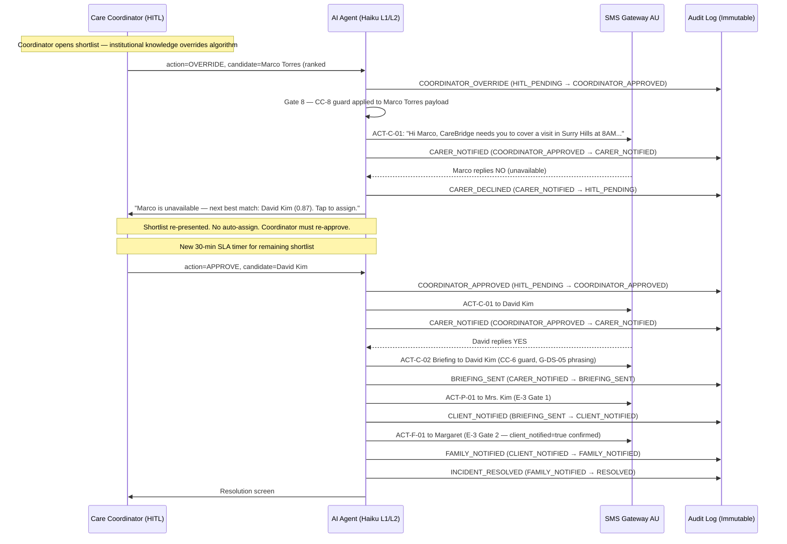

# Extracted from: akshayyelne/Home-Care-AI-Product-Management/.claude/skills/Execution/Artifact_23_Agentic_Logic_Spec.md
# Generated: 2026-07-31T00:49:45.157Z

**Project:** Home-Care-AI
**Stage:** Execution → Stage B (The Engineering Blueprint — Logic)
**Skill:** agentic-logic-spec
**Date:** 2026-03-28
**Author Role:** Technical PM & System Architect
**Feature:** Vacancy Incident Processing Pipeline — Smart Match + HITL Approval + Notification Dispatch

**Handshake Inputs Consumed:**

| ID | Source | What Transferred |
|---|---|---|
| **HS-STRAT-01** | Artifact 15 §4 (Moment of Truth) + §6 (L3 Interventions) | All L3 actions (ACT-C-01, ACT-C-02, ACT-P-01, ACT-F-01, VACANCY_UNRESOLVED) → Gates 8–14 |
| **HS-STRAT-02a–i** | Artifact 16 §9 (Mitigation Requirements) | NFR-01–06 + compound guards CC-1, CC-4, CC-6, CC-8, G-E3-1, G-DS-05 |
| **HS-STRAT-03** | Artifact 20 §12 (Token Budget) | Haiku → L1/L2 (≤2,200 tokens); Sonnet → L3 only (≤3,500 tokens); No LLM → notifications |
| **HS-STRAT-04** | Artifact 14 §6 (OKRs) | OKR-1 through OKR-6 → success criteria for each gate |
| **Artifact 22 BS-1** | Artifact 16 §7 canonical event registry | 31-event registry is canonical — this spec uses those event names only |
| **Artifact 22 BS-2** | F10 dormant schema fields | credential_expiry_date, care_plan_review_due_date, visit.documentation_complete planted in Wave 1 schema |
| **Artifact 22 BS-4** | VACANCY_UNRESOLVED threshold | `VACANCY_UNRESOLVED_ALERT_THRESHOLD = 0.10` (10%/14 days) → PM Lead L1 alert |
| **Artifact 22 BS-5** | EC-04 cold-start definition | SPP cold-start (P-10 = 0) is EC-04 — distinct from EC-02 (roster exhaustion) |

**Feeds into:**
- `user-stories` (Execution Stage B, Skill 4) — each story's acceptance criteria must reference named audit fields from §8
- `synthetic-phi-generator` (Execution Stage C, Skill 5) — threshold constants in §3 drive test data generation
- ECC (Claude Code) — pseudocode in §4 is the implementation blueprint
- `harness-audit-grader` (Execution Stage D, Skill 6) — §8 audit schema is the SD-01B contract

**Regulatory Context:** Australian Privacy Act 1988 (APP). HIPAA-grade security as design floor. All data in AWS ap-southeast-2 (Sydney). No cross-border transmission in v1.


When a carer calls in sick, the Home-Care-AI vacancy incident pipeline automatically finds the best replacement, presents a ranked shortlist to the care coordinator for one-tap approval, and — once approved — dispatches all notifications in the legally required order. The pipeline is event-driven: a `vacancy_recorded` event triggers the entire flow. It begins with a hard qualification gate (no expired credentials, no scheduling conflicts), then scores qualified carers on two weighted dimensions: proximity to the client (40%) and SPP match quality (60%, sourced from the client's Soft Preference Profile — visit history, familiarity threshold, binary acceptance flag). The coordinator is the human-in-the-loop (HITL): the system never assigns a carer without coordinator approval. If the coordinator does not respond within 30 minutes, a backup coordinator is notified. If neither responds, the incident is escalated to `VACANCY_UNRESOLVED` — the system never auto-assigns and never leaves an incident in a hanging state. After approval, the system sends the assignment SMS to the carer (CC-8 compliant — no PHI), the briefing SMS after confirmation (CC-6 compliant — no match explanation), the client notification (G-DS-05 phrasing branch), and finally the family notification — but only after the client has been notified (E-3 Gate 2: the Arthur Kovacs constraint). Every state transition produces an immutable audit log entry. All external content is template-interpolated — no LLM generates text sent to carers, clients, or families.


### Inputs

```
// Trigger
Input: vacancy_data.client_id          // Type: UUID | Source: coordinator-recorded or carer-reported
Input: vacancy_data.visit_time         // Type: Timestamp ISO 8601 UTC | Source: scheduling system
Input: vacancy_data.absent_carer_id    // Type: UUID | Source: absence record
Input: vacancy_data.care_requirements  // Type: String[] | Source: client record (structured qualifications list)

// Client SPP (Soft Preference Profile)
Input: client.familiarity_threshold    // Type: Enum ['KNOWN_CARERS_ONLY','BRIEFED_ACCEPTABLE','ANY'] | Source: SPP P-3
Input: client.spp_completeness_score   // Type: Float 0.0–1.0 (P-10) | Source: computed field
Input: client.suburb                   // Type: String (suburb name) | Source: SPP P-11 (suburb only — never full address)
Input: client.notification_channel    // Type: String (phone number) | Source: F-1 enrolment
Input: client.family_contact_channel  // Type: String (phone number) | Source: F-2 enrolment
Input: client.cognitive_flag          // Type: Boolean (P-4) | Source: SPP (consent-gated)
Input: client.personal_sensitivities  // Type: String max 100 chars (P-5) | Source: SPP

// Carer Records
Input: carer.qualifications           // Type: String[] | Source: HR database
Input: carer.credential_expiry_dates  // Type: Map<credential, Date> | Source: HR database (Wave 1 dormant: carer.credential_expiry_date)
Input: carer.availability_calendar    // Type: TimeSlot[] | Source: scheduling system
Input: carer.postcode                 // Type: String | Source: carer self-reported (S-2)
Input: carer.phone_number             // Type: String | Source: employment contract (S-1b, tokenized reference)

// Computed SPP history
Input: p7_visit_count(carer_id, client_id)    // Type: Integer | Source: visit log
Input: p8_binary_flag(carer_id, client_id)    // Type: Boolean | Source: visit outcome log
```

### States

```
State: NORMAL                // No active vacancy incident
State: VACANCY_DETECTED      // vacancy_recorded event received; input validation passed
State: SHORTLIST_READY       // Qualification + scoring complete; ranked shortlist generated
State: HITL_PENDING          // Coordinator push notification sent; SLA timer running
State: COORDINATOR_APPROVED  // Coordinator tapped Approve; coordinator_approved = true
State: CARER_NOTIFIED        // Assignment SMS sent; carer reply timer running
State: BRIEFING_SENT         // Carer replied YES; briefing SMS sent
State: CLIENT_NOTIFIED       // Client notification SMS delivered; client_notified = true
State: FAMILY_NOTIFIED       // Family notification SMS delivered (E-3 Gate 2 passed)
State: RESOLVED              // Incident closed; resolution screen shown to coordinator
State: VACANCY_UNRESOLVED    // Terminal failure state — no candidate assigned; coordinator + agency owner alerted
```

### Outputs

```
Output: push_notification(recipient, message, urgency_level)         // Level 1 — informational
Output: serve_shortlist(coordinator_id, shortlist, vacancy_data)     // Level 1 — display only
Output: serve_approval_card(coordinator_id, candidate, preview)      // Level 1 — display only
Output: send_sms(channel, recipient, template, vars, content_generation_method)  // Level 3 — external action
Output: log_event(APPAuditLogEntry)                                  // Level 1 — immutable write
Output: alert_coordinator(message, urgency_level)                    // Level 1 — internal push
Output: escalate_vacancy_unresolved(case_id, incident_data)          // Level 3 — Sonnet; agency owner notified
Output: alert_pm_lead(message)                                       // Level 1 — rolling threshold breach
```


All constants named here must appear verbatim in the implementation. Any change to a constant value requires a PR comment with justification. Named constants are referenced in every audit log entry's `threshold_applied` field.

```
// Scoring weights (must sum to 1.0)
CONST SCORING_WEIGHT_FAMILIARITY            = 0.60   // P-7/P-8 familiarity history drives 60% of score
CONST SCORING_WEIGHT_PROXIMITY              = 0.40   // Geographic proximity drives 40% of score
// Rationale: Angela (CC-001) interview: "Who the client knows matters more than how far they travel."
// Review cadence: after E1 validation of OKR-3 (≥70% 1-tap trust rate)

// Shortlist
CONST SHORTLIST_MAX_CANDIDATES              = 3      // Maximum candidates shown to coordinator
CONST PROXIMITY_MAX_KM                      = 25     // Maximum carer distance (km) to be included in shortlist
// Rationale: Sydney metro + outer suburbs. Carers >25km away unlikely to arrive on time.
// Review cadence: after geographic coverage data from first 20 agencies

// SLA timers
CONST COORDINATOR_APPROVAL_SLA_MIN         = 30     // Minutes — primary coordinator HITL window
CONST BACKUP_COORDINATOR_SLA_MIN           = 15     // Minutes — backup coordinator HITL window
CONST CARER_REPLY_GRACE_MIN                = 15     // Minutes — carer YES/NO reply window
// Rationale: Artifact 15 §3 workflow. Angela's "45-minute morning cascade" sets the ceiling.
// Review cadence: after E1 carer reply-rate data (XP-4A)

// SPP cold-start
CONST SPP_COLD_START_THRESHOLD             = 0      // P-10 = 0 triggers EC-04 path
// Rationale: Zero SPP completeness → matching falls back to proximity-only. Coordinator card shows invitation.

// Familiarity scoring normalisation
CONST FAMILIARITY_VISIT_CAP                = 5      // Visit counts above 5 treated as maximum familiarity (1.0)
CONST FAMILIARITY_BINARY_FLOOR             = 0.80   // P-8 acceptance flag floors familiarity score at 0.80

// Compliance feature flags (defaults — toggled only by Privacy Officer or Legal sign-off)
CONST E1_LEGAL_SIGNOFF                     = false  // P-2 excluded from scoring until anti-discrimination opinion obtained
CONST WHATSAPP_APP8_CONFIRMED              = false  // WhatsApp channel locked until APP 8 DPA confirmed
CONST SC07_GOOGLE_MAPS_APPROVED            = false  // Google Maps API locked until APP 8 review complete (AX-01 action)
// Note: SC07_GOOGLE_MAPS_APPROVED does NOT block shortlist generation — proximity falls back to POSTCODE_ZONE mode

// Audit + compliance
CONST AUDIT_LOG_RETENTION_YEARS            = 7      // HIPAA-grade floor — append-only; no DELETE or UPDATE

// VACANCY_UNRESOLVED rolling threshold
CONST VACANCY_UNRESOLVED_ALERT_THRESHOLD   = 0.10   // 10% over 14-day rolling window → PM Lead L1 alert
CONST VACANCY_UNRESOLVED_WINDOW_DAYS       = 14     // Rolling window for alert threshold calculation
// Rationale: Artifact 22 BS-4. Above 10% indicates match algorithm degradation requiring PM review.

// Schema enforcement
CONST P9_FREE_TEXT_FIELD_PERMITTED         = false  // Always false — CRIT-04. Any schema with this field is CRITICAL defect.

// Model selection (HS-STRAT-03 binding)
CONST TOKEN_BUDGET_L1_L2                   = 2200   // Haiku: all routine orchestration
CONST TOKEN_BUDGET_L3                      = 3500   // Sonnet: VACANCY_UNRESOLVED escalation only
CONST MODEL_L1_L2                          = 'claude-haiku-4-5-20251001'
CONST MODEL_L3                             = 'claude-sonnet-4-6'

// F10 dormant fields (Wave 1 schema — display deferred to P1.1, data planted Wave 1)
// These are schema field names — not logic constants — but named here for ECC visibility
// DORMANT: carer.credential_expiry_date     → powers F10 Compliance Dashboard (P1.1)
// DORMANT: client.care_plan_review_due_date → powers F10 Compliance Dashboard (P1.1)
// DORMANT: visit.documentation_complete     → powers F10 Compliance Dashboard (P1.1)
```


```
// =============================================================================
// HOME-CARE-AI — VACANCY INCIDENT PROCESSING PIPELINE
// Model: Haiku (L1/L2) unless explicitly noted as Sonnet (L3)
// Content generation: TEMPLATE_INTERPOLATION only (CRIT-02)
// =============================================================================

ON_EVENT vacancy_recorded(vacancy_data):

  // -------------------------------------------------------------------------
  // GATE 0 — Input Validation + Idempotency Guard
  // -------------------------------------------------------------------------
  IF vacancy_data.client_id IS NULL OR vacancy_data.visit_time IS NULL OR
     vacancy_data.absent_carer_id IS NULL:
    log_event(event_type='INPUT_VALIDATION_FAILED',
              state_before='NORMAL', state_after='NORMAL',
              action_taken='DISCARD_EVENT',
              ai_confidence_score=1.0, model_id=MODEL_L1_L2)
    alert_coordinator("Incomplete vacancy data received — please re-submit the absence.")
    RETURN

  IF duplicate_vacancy_exists(vacancy_data.client_id, vacancy_data.visit_time):
    log_event(event_type='DUPLICATE_VACANCY_SUPPRESSED',
              state_before='NORMAL', state_after='NORMAL',
              action_taken='DISCARD_DUPLICATE')
    RETURN  // Idempotency guard — prevents double-processing

  SET case_id = generate_uuid_v4()
  SET incident_state = 'VACANCY_DETECTED'
  log_event(event_type='VACANCY_DETECTED',
            state_before='NORMAL', state_after='VACANCY_DETECTED',
            case_id=case_id, action_taken='INCIDENT_OPENED')


  // -------------------------------------------------------------------------
  // GATE 1 — Qualification Filter (ACT-V-02 — hard binary, pass/fail)
  // -------------------------------------------------------------------------
  qualified_carers = []

  FOR EACH carer IN agency_roster:
    IF carer.id == vacancy_data.absent_carer_id:
      SKIP  // Do not re-assign the absent carer

    IF NOT carer.available_at(vacancy_data.visit_time):
      SKIP  // Scheduling conflict

    IF has_expired_credential(carer, vacancy_data.care_requirements):
      SKIP  // Hard block — no expired credentials regardless of match quality
      // Note: carer.credential_expiry_date is a Wave 1 schema field (F10 dormant)

    IF NOT qualifications_match(carer, vacancy_data.care_requirements):
      SKIP  // Required qualification not held

    qualified_carers.append(carer)

  IF qualified_carers.length == 0:
    // EC-01: No qualified carers in roster for this visit
    GOTO Gate 14 // VACANCY_UNRESOLVED — no candidates to offer coordinator


  // -------------------------------------------------------------------------
  // GATE 2 — SPP Cold-Start Check (EC-04)
  // P-10 = 0 → all clients in this incident have zero SPP completeness
  // -------------------------------------------------------------------------
  client = fetch_client_record(vacancy_data.client_id)

  IF client.spp_completeness_score == SPP_COLD_START_THRESHOLD:  // P-10 = 0
    SET briefing_mode = 'MINIMAL'
    log_event(event_type='SPP_COLD_START',
              state_before='VACANCY_DETECTED', state_after='VACANCY_DETECTED',
              action_taken='BRIEFING_MODE_SET_MINIMAL',
              guard_id='EC-04', guard_passed=true)
    // Note: SPP cold-start does NOT block matching. Scoring falls back to proximity-only.
    // Coordinator card must show: "Add [client.first_name]'s preferences now — 2 min" (DR-4 compliant)
    // This is EC-04 — distinct from EC-02 (roster exhaustion) and EC-03 (partial SPP)
  ELSE:
    SET briefing_mode = 'FULL'


  // -------------------------------------------------------------------------
  // GATE 3 — Proximity Scoring (ACT-V-03)
  // APP 8 note: Google Maps transmits carer.postcode to US servers (SC-07 pending)
  // Fallback to POSTCODE_ZONE mode until SC07_GOOGLE_MAPS_APPROVED = true
  // -------------------------------------------------------------------------
  FOR EACH carer IN qualified_carers:
    IF SC07_GOOGLE_MAPS_APPROVED == true:
      // Only carer.postcode transmitted to Google Maps API — never client address, never client name
      distance_km = google_maps_distance_matrix(carer.postcode, client.suburb)
      ASSERT google_maps_payload_contains(['carer_postcode']) ONLY  // CC-8 pre-check on API call
    ELSE:
      // Postcode zone fallback — no external API call required, no APP 8 trigger
      distance_km = postcode_zone_distance(carer.postcode, client.suburb)
      // Note: postcode_zone_distance() uses a pre-loaded AU postcode→suburb zone mapping
      // Accuracy: ±3km for metro areas. Acceptable for v1 shortlist ranking.

    IF distance_km > PROXIMITY_MAX_KM:
      qualified_carers.remove(carer)  // Outside acceptable radius
      CONTINUE

    // Normalise: closer = higher score (1.0 = same suburb, 0.0 = PROXIMITY_MAX_KM)
    carer.proximity_score = max(0.0, 1.0 - (distance_km / PROXIMITY_MAX_KM))

  IF qualified_carers.length == 0:
    // EC-01 variant: all qualified carers are outside proximity radius
    GOTO Gate 14  // VACANCY_UNRESOLVED


  // -------------------------------------------------------------------------
  // GATE 4 — SPP Match Scoring (ACT-V-04)
  // Weights: familiarity 0.60, proximity 0.40
  // G-CC-4: P-2 excluded until E1_LEGAL_SIGNOFF = true
  // -------------------------------------------------------------------------
  carers_to_remove = []

  FOR EACH carer IN qualified_carers:
    familiarity_score = 0.0

    IF briefing_mode == 'FULL':
      // P-7: Visit count with this specific client
      visit_count = p7_visit_count(carer.id, client.id)
      IF visit_count > 0:
        familiarity_score = min(1.0, visit_count / FAMILIARITY_VISIT_CAP)

      // P-8: Binary acceptance flag (client has explicitly accepted this carer before)
      IF p8_binary_flag(carer.id, client.id) == true:
        familiarity_score = max(familiarity_score, FAMILIARITY_BINARY_FLOOR)  // Floor at 0.80

      // P-3: Familiarity threshold hard filter
      // "Known carers only" clients: unfamiliar carers are disqualified entirely
      IF client.familiarity_threshold == 'KNOWN_CARERS_ONLY' AND visit_count == 0:
        carers_to_remove.append(carer)  // Hard filter — cannot be overridden by proximity
        CONTINUE

    // G-CC-4 guard: P-2 advisory only, never scored
    // Named constant default: E1_LEGAL_SIGNOFF = false
    IF E1_LEGAL_SIGNOFF == false:
      p2_weight = 0.0  // P-2 excluded from scoring_weights
      // P-2 is displayed on coordinator card as: "Client preference (advisory — not scored)"
      log_event(event_type='COMPLIANCE_OVERRIDE_ACKNOWLEDGED',
                guard_id='G-CC-4', guard_passed=true,
                action_taken='P2_EXCLUDED_FROM_SCORING')
    // If E1_LEGAL_SIGNOFF later becomes true, p2_weight assignment changes here —
    // matching engine rebuild required; CRIT-03 constraint formally lifted

    carer.composite_score = (familiarity_score * SCORING_WEIGHT_FAMILIARITY) +
                            (carer.proximity_score * SCORING_WEIGHT_PROXIMITY)

  // Apply P-3 hard filter
  FOR EACH carer IN carers_to_remove:
    qualified_carers.remove(carer)

  IF qualified_carers.length == 0:
    // P-3 'KNOWN_CARERS_ONLY' filter eliminated all candidates
    // This is the KNOWN_CARERS_ONLY + no-familiar-carers-available edge case
    // Coordinator must manually find someone the client knows, or manage client expectations
    GOTO Gate 14  // VACANCY_UNRESOLVED


  // -------------------------------------------------------------------------
  // GATE 5 — Shortlist Generation (ACT-V-06)
  // Maximum SHORTLIST_MAX_CANDIDATES candidates, ranked by composite_score descending
  // -------------------------------------------------------------------------
  shortlist = qualified_carers
              .sort(by='composite_score', order='descending')
              .take(SHORTLIST_MAX_CANDIDATES)

  // CC-1 compound guard: P-3 + P-4 + P-5 must never appear together in any external payload
  // Coordinator shortlist payload contains: carer name, familiarity count, qualification badge, proximity
  // It does NOT contain P-4 (cognitive flags) or P-5 (personal sensitivities) — those are in briefing only
  // Assert pre-build that the shortlist payload assembly function enforces this
  ASSERT coordinator_shortlist_payload_builder.contains_p4 == false  // guard_id='CC-1'
  ASSERT coordinator_shortlist_payload_builder.contains_p5 == false  // guard_id='CC-1'

  // RAG architectural pre-specification (HIGH-05)
  // If any future feature retrieves SPP fields from a vector store:
  //   MANDATORY: filter = {'client_id': vacancy_data.client_id}
  //   Any retrieval query without this filter MUST raise a runtime error (not silently proceed)
  // This is NFR-05 — specified here even though no RAG feature is in v1

  log_event(event_type='SHORTLIST_GENERATED',
            state_before='VACANCY_DETECTED', state_after='SHORTLIST_READY',
            action_taken='SHORTLIST_BUILT',
            ai_confidence_score=shortlist[0].composite_score)
  SET incident_state = 'SHORTLIST_READY'


  // -------------------------------------------------------------------------
  // GATE 6 — Coordinator HITL Notification (ACT-V-05)
  // Level 1 action — push notification only; no action taken without coordinator tap
  // -------------------------------------------------------------------------
  log_event(event_type='HITL_REQUESTED',
            state_before='SHORTLIST_READY', state_after='HITL_PENDING',
            action_taken='COORDINATOR_NOTIFIED',
            hitl_id=primary_coordinator.id, reviewer_role='CARE_COORDINATOR')
  SET incident_state = 'HITL_PENDING'

  push_notification(
    recipient = primary_coordinator,
    message = "[absent_carer.first_name] called in sick — [N] visits affected. Replacements ready for review.",
    urgency_level = 'HIGH'
  )

  // Session isolation requirement (HIGH-06)
  // The coordinator's shortlist session is scoped to this case_id only.
  // On session expiry or logout, shortlist data is cleared from coordinator app memory.
  // Per-session encryption key provisioned for this case.
  SET coordinator_session = create_session(case_id, primary_coordinator.id, expires_on_logout=true)

  START_SLA_TIMER(coordinator_id=primary_coordinator.id,
                  duration=COORDINATOR_APPROVAL_SLA_MIN,
                  on_timeout=GOTO Gate_7c_primary_timeout)


  // -------------------------------------------------------------------------
  // GATE 7a — Coordinator Approves Top Candidate (Happy Path)
  // -------------------------------------------------------------------------
  ON_COORDINATOR_ACTION(coordinator_id, action='APPROVE', candidate_id):
    CANCEL_SLA_TIMER(coordinator_id=primary_coordinator.id)
    selected_carer = fetch_carer(candidate_id)
    SET coordinator_approved = true

    // Validate this action is from the active session (session isolation HIGH-06)
    ASSERT coordinator_session.case_id == case_id
    ASSERT coordinator_session.user_id == coordinator_id

    log_event(event_type='COORDINATOR_APPROVED',
              state_before='HITL_PENDING', state_after='COORDINATOR_APPROVED',
              user_id=coordinator_id, hitl_id=coordinator_id,
              hitl_decision='CONFIRMED',
              hitl_response_ms=elapsed_since_hitl_requested(),
              action_taken='CANDIDATE_APPROVED',
              ai_confidence_score=selected_carer.composite_score,
              threshold_applied='SCORING_WEIGHT_FAMILIARITY=0.60|SCORING_WEIGHT_PROXIMITY=0.40')
    SET incident_state = 'COORDINATOR_APPROVED'
    GOTO Gate 8


  // -------------------------------------------------------------------------
  // GATE 7b — Coordinator Selects Non-Top Candidate (Override)
  // -------------------------------------------------------------------------
  ON_COORDINATOR_ACTION(coordinator_id, action='OVERRIDE', candidate_id):
    // Override is valid — coordinator has institutional knowledge the algorithm may lack
    CANCEL_SLA_TIMER(coordinator_id=primary_coordinator.id)
    selected_carer = fetch_carer(candidate_id)
    SET coordinator_approved = true

    log_event(event_type='COORDINATOR_OVERRIDE',
              state_before='HITL_PENDING', state_after='COORDINATOR_APPROVED',
              user_id=coordinator_id, hitl_id=coordinator_id,
              hitl_decision='CONFIRMED',
              hitl_notes='Coordinator selected non-top-ranked candidate',
              hitl_response_ms=elapsed_since_hitl_requested(),
              action_taken='CANDIDATE_OVERRIDE_SELECTED')
    SET incident_state = 'COORDINATOR_APPROVED'
    GOTO Gate 8


  // -------------------------------------------------------------------------
  // GATE 7c — Primary Coordinator Timeout (30-min SLA expired)
  // -------------------------------------------------------------------------
  ON_SLA_TIMEOUT(coordinator_id=primary_coordinator.id):
    log_event(event_type='HITL_TIMEOUT',
              state_before='HITL_PENDING', state_after='HITL_PENDING',
              reviewer_role='CARE_COORDINATOR',
              hitl_id=primary_coordinator.id,
              hitl_response_ms=null,
              hitl_decision='TIMEOUT',
              action_taken='ESCALATE_TO_BACKUP_COORDINATOR')

    backup_coordinator = fetch_backup_coordinator(agency_id)

    IF backup_coordinator != null:
      push_notification(
        recipient = backup_coordinator,
        message = "[primary_coordinator.first_name] hasn't responded — [N] visits need a replacement approved. URGENT.",
        urgency_level = 'CRITICAL'
      )
      log_event(event_type='HITL_TIER_ESCALATED',
                state_before='HITL_PENDING', state_after='HITL_PENDING',
                hitl_id=backup_coordinator.id, reviewer_role='CARE_COORDINATOR',
                action_taken='BACKUP_COORDINATOR_NOTIFIED')

      START_SLA_TIMER(coordinator_id=backup_coordinator.id,
                      duration=BACKUP_COORDINATOR_SLA_MIN,
                      on_timeout=GOTO Gate_7d_backup_timeout)

      // Gate 7a/7b logic applies identically for backup_coordinator response
      ON_COORDINATOR_ACTION(coordinator_id=backup_coordinator.id, ...):
        // Proceed as 7a or 7b above
        GOTO Gate 8

    ELSE:
      // No backup coordinator configured — treat as double timeout immediately
      GOTO Gate_7d_backup_timeout


  // -------------------------------------------------------------------------
  // GATE 7d — Backup Coordinator Timeout → VACANCY_UNRESOLVED
  // -------------------------------------------------------------------------
  ON_SLA_TIMEOUT(coordinator_id=backup_coordinator.id):
    log_event(event_type='HITL_DOUBLE_TIMEOUT',
              state_before='HITL_PENDING', state_after='VACANCY_UNRESOLVED',
              hitl_decision='TIMEOUT',
              hitl_response_ms=null,
              action_taken='ESCALATE_VACANCY_UNRESOLVED')
    GOTO Gate 14  // VACANCY_UNRESOLVED — never auto-assign


  // -------------------------------------------------------------------------
  // GATE 8 — Carer Assignment SMS (ACT-C-01)
  // Level 3 action — requires coordinator_approved = true (Gate invariant)
  // CC-8 guard: no PHI in carer notification payload
  // CRIT-02: template interpolation only — no LLM
  // -------------------------------------------------------------------------
  ASSERT coordinator_approved == true  // Hard gate — never bypassed

  // CC-8 guard: build payload from whitelisted fields only
  carer_notification_payload = {
    carer_first_name: selected_carer.first_name,   // S-1a (first name only)
    agency_name:      agency.name,
    client_suburb:    client.suburb,               // P-11 suburb only — NEVER full address
    visit_time:       vacancy_data.visit_time
  }

  // Explicitly assert no sensitive fields in payload
  ASSERT 'client_full_name'     NOT IN carer_notification_payload  // guard_id='CC-8'
  ASSERT 'client_full_address'  NOT IN carer_notification_payload  // guard_id='CC-8'
  ASSERT 'client_id_uuid'       NOT IN carer_notification_payload  // guard_id='CC-8'
  ASSERT 'spp_fields'           NOT IN carer_notification_payload  // guard_id='CC-8'
  ASSERT 'health_information'   NOT IN carer_notification_payload  // guard_id='CC-8'
  log_event(event_type='CC8_FIELD_STRIPPED',
            guard_id='CC-8', guard_passed=true,
            action_taken='PAYLOAD_SANITISED_PRE_SEND')

  // Channel routing (CRIT-01: SMS AU-hosted only until WHATSAPP_APP8_CONFIRMED = true)
  ASSERT WHATSAPP_APP8_CONFIRMED == false  // Default — locked by Privacy Officer
  channel = resolve_channel(WHATSAPP_APP8_CONFIRMED)  // Returns 'SMS_AU' if false
  // SMS_AU = MessageMedia or AWS SNS ap-southeast-2 — no cross-border transmission

  send_sms(
    channel = channel,
    recipient = selected_carer.phone_number,
    template = "Hi {carer_first_name}, {agency_name} needs you to cover a visit for a client in "
               "{client_suburb} at {visit_time}. Reply YES to confirm or NO if unavailable.",
    vars = carer_notification_payload,
    content_generation_method = 'TEMPLATE_INTERPOLATION'
  )
  ASSERT content_generation_method == 'TEMPLATE_INTERPOLATION'  // CRIT-02 — no LLM call

  log_event(event_type='CARER_NOTIFIED',
            state_before='COORDINATOR_APPROVED', state_after='CARER_NOTIFIED',
            action_taken='ACT_C_01_SENT',
            cross_border_disclosure=false, app8_basis='Domestic',
            lawful_basis='Operations', data_sensitivity='PII')
  SET incident_state = 'CARER_NOTIFIED'

  START_SLA_TIMER(carer_id=selected_carer.id,
                  duration=CARER_REPLY_GRACE_MIN,
                  on_timeout=GOTO Gate_10c_carer_timeout)


  // -------------------------------------------------------------------------
  // GATE 9 — Carer Briefing (ACT-C-02)
  // RUNS AFTER CARER CONFIRMS (Gate 10a) — not immediately after assignment SMS
  // CC-6 guard: no match explanation, no gender preference in briefing payload
  // G-DS-05 guard: familiarity phrasing branches on client.familiarity_threshold
  // CC-1 guard: P-3+P-4+P-5 never together in any single payload
  // -------------------------------------------------------------------------
  FUNCTION assemble_and_send_briefing(client, selected_carer, briefing_mode):

    briefing_payload = {}

    // CC-6 guard: assert no match explanation or gender preference before payload assembly
    ASSERT 'match_explanation'  NOT IN briefing_payload  // guard_id='G-CC-6'
    ASSERT 'gender_preference'  NOT IN briefing_payload  // guard_id='G-CC-6'
    ASSERT 'scoring_weights'    NOT IN briefing_payload  // guard_id='G-CC-6'

    IF briefing_mode == 'FULL':
      // P-5: Personal sensitivities (structured, ≤100 chars — not free text)
      IF client.personal_sensitivities NOT NULL:
        briefing_payload.sensitivities_note = client.personal_sensitivities

      // P-6: Entry protocol
      IF client.entry_protocol NOT NULL:
        briefing_payload.entry_note = client.entry_protocol

      // G-DS-05 phrasing branch: client.familiarity_threshold drives wording
      IF client.familiarity_threshold == 'KNOWN_CARERS_ONLY':
        briefing_payload.familiarity_note = "This client prefers familiar carers — "
                                            "please introduce yourself clearly and take a calm, "
                                            "steady approach."
      ELSE IF client.familiarity_threshold == 'BRIEFED_ACCEPTABLE':
        briefing_payload.familiarity_note = "This client has been briefed that you may be visiting. "
                                            "They know your name."
      // 'ANY' threshold: no special familiarity note required
    ELSE:
      // briefing_mode == 'MINIMAL' (EC-04 cold-start)
      briefing_payload.familiarity_note = "Client preferences have not yet been set up. "
                                          "Please introduce yourself warmly at arrival."

    // CC-1 compound guard: P-3 + P-4 + P-5 must never appear together in external payload
    p3_in_payload = briefing_payload.familiarity_note NOT NULL AND client.familiarity_threshold NOT NULL
    p4_in_payload = client.cognitive_flag == true AND briefing_payload.cognitive_guidance NOT NULL
    p5_in_payload = briefing_payload.sensitivities_note NOT NULL

    IF p3_in_payload AND p4_in_payload AND p5_in_payload:
      // CC-1 violation: full vulnerability profile in a single carer payload
      log_event(event_type='CC6_GUARD_BLOCKED',  // Closest canonical event for guard block
                guard_id='CC-1', guard_passed=false,
                action_taken='BRIEFING_SUPPRESSED_CC1_VIOLATION')
      alert_coordinator("Briefing blocked — compound sensitivity guard CC-1 triggered. "
                        "Review and send manually to avoid disclosing full vulnerability profile.")
      RETURN  // Do not send — coordinator must manually manage

    // P-4 (cognitive flag) must be stripped from external payload entirely
    ASSERT 'cognitive_flag' NOT IN briefing_payload   // P-4 — NEVER in external payload
    ASSERT 'p4_raw_value'   NOT IN briefing_payload   // P-4

    log_event(event_type='CC6_GUARD_BLOCKED' IF cc6_fails ELSE 'BRIEFING_SENT',
              guard_id='G-CC-6', guard_passed=true)

    send_sms(
      channel = channel,
      recipient = selected_carer.phone_number,
      template = briefing_template,
      vars = briefing_payload,
      content_generation_method = 'TEMPLATE_INTERPOLATION'
    )
    ASSERT content_generation_method == 'TEMPLATE_INTERPOLATION'  // CRIT-02

    log_event(event_type='BRIEFING_SENT',
              state_before='CARER_NOTIFIED', state_after='BRIEFING_SENT',
              action_taken='ACT_C_02_SENT',
              consent_record_id=client.spp_consent_record_id,  // HIGH-02: lawful basis for P-5/P-6 disclosure
              lawful_basis='Treatment', data_sensitivity='SENSITIVE_INFO')
    SET incident_state = 'BRIEFING_SENT'


  // -------------------------------------------------------------------------
  // GATE 10a — Carer Confirms (YES)
  // -------------------------------------------------------------------------
  ON_CARER_REPLY(carer_id=selected_carer.id, reply='YES'):
    CANCEL_SLA_TIMER(carer_id=selected_carer.id)
    // State transition: CARER_NOTIFIED → BRIEFING_SENT (via assemble_and_send_briefing)
    assemble_and_send_briefing(client, selected_carer, briefing_mode)
    GOTO Gate 11


  // -------------------------------------------------------------------------
  // GATE 10b — Carer Declines (NO)
  // -------------------------------------------------------------------------
  ON_CARER_REPLY(carer_id=selected_carer.id, reply='NO'):
    CANCEL_SLA_TIMER(carer_id=selected_carer.id)
    log_event(event_type='CARER_DECLINED',
              state_before='CARER_NOTIFIED', state_after='HITL_PENDING',
              action_taken='SHORTLIST_RE_PRESENTED',
              hitl_decision=null)
    SET incident_state = 'HITL_PENDING'

    // Re-surface shortlist — coordinator must re-approve; no auto-assign
    remaining_shortlist = shortlist.remove(selected_carer)
    SET coordinator_approved = false

    IF remaining_shortlist.length > 0:
      alert_coordinator(
        "[selected_carer.first_name] is unavailable — next best match: "
        "[remaining_shortlist[0].first_name]. Tap to assign.",
        urgency_level = 'HIGH'
      )
      // Coordinator re-approves: return to Gate 7a with remaining_shortlist
      GOTO Gate 7 (remaining_shortlist, same case_id, new SLA timer)

    ELSE:
      // EC-02: All shortlist candidates exhausted
      GOTO Gate 14  // VACANCY_UNRESOLVED


  // -------------------------------------------------------------------------
  // GATE 10c — Carer No-Reply (SLA timeout)
  // Treated as implicit decline — treated identically to Gate 10b
  // -------------------------------------------------------------------------
  ON_SLA_TIMEOUT(carer_id=selected_carer.id):
    alert_coordinator(
      "[selected_carer.first_name] hasn't replied in {CARER_REPLY_GRACE_MIN} minutes. "
      "Confirm this carer or pick another candidate.",
      urgency_level = 'HIGH'
    )
    log_event(event_type='CARER_DECLINED',
              state_before='CARER_NOTIFIED', state_after='HITL_PENDING',
              action_taken='CARER_TIMEOUT_TREATED_AS_DECLINE')
    GOTO Gate 10b logic (re-surface shortlist)


  // -------------------------------------------------------------------------
  // GATE 11 — E-3 Gate 1: Client Notification (ACT-P-01)
  // Level 3 action — requires coordinator_approved = true
  // G-DS-05: phrasing branches on familiarity threshold + visit history
  // -------------------------------------------------------------------------
  ASSERT coordinator_approved == true  // Gate invariant
  SET client_notified = false

  visit_count_for_assigned = p7_visit_count(selected_carer.id, client.id)

  // G-DS-05 phrasing branch — see Artifact 16 CC-2 and G-DS-05 guard
  IF visit_count_for_assigned > 0:
    client_sms_template = "Good morning, this is {agency_name}. Your visit today will be with "
                          "{carer_first_name}, who has visited you before. "
                          "They'll arrive at {visit_time}."

  ELSE IF client.familiarity_threshold == 'BRIEFED_ACCEPTABLE' AND visit_count_for_assigned == 0:
    client_sms_template = "Good morning, this is {agency_name}. Your visit today will be covered "
                          "by {carer_first_name}. They know about your preferences and will "
                          "introduce themselves when they arrive at {visit_time}."

  ELSE IF client.familiarity_threshold == 'KNOWN_CARERS_ONLY' AND visit_count_for_assigned == 0:
    // This state MUST NOT be reached — Gate 4 P-3 filter should have prevented this assignment.
    // If somehow reached: it is a Gate 4 logic error — escalate as G-DS-05 violation.
    log_event(event_type='COMPLIANCE_OVERRIDE_ACKNOWLEDGED',
              guard_id='G-DS-05', guard_passed=false,
              action_taken='G_DS05_VIOLATION_DETECTED')
    alert_coordinator("Error: [client.first_name] requires a known carer, but [carer.first_name] "
                      "has no prior visits. Please select a known carer manually.")
    GOTO Gate 14  // VACANCY_UNRESOLVED — constraint cannot be satisfied

  // E-3 Gate 1: send client notification
  sms_result = send_sms(
    channel = 'SMS_AU',
    recipient = client.notification_channel,
    template = client_sms_template,
    vars = { agency_name, carer_first_name, visit_time },
    content_generation_method = 'TEMPLATE_INTERPOLATION'
  )
  ASSERT content_generation_method == 'TEMPLATE_INTERPOLATION'  // CRIT-02

  IF sms_result.delivered == true:
    SET client_notified = true
    log_event(event_type='CLIENT_NOTIFIED',
              state_before='BRIEFING_SENT', state_after='CLIENT_NOTIFIED',
              action_taken='ACT_P_01_SENT',
              lawful_basis='Treatment', data_sensitivity='PII')
    SET incident_state = 'CLIENT_NOTIFIED'
    GOTO Gate 12

  ELSE:
    SET client_notified = false
    log_event(event_type='CLIENT_NOTIFICATION_UNAVAILABLE',
              state_before='BRIEFING_SENT', state_after='BRIEFING_SENT',
              action_taken='ACT_P_01_FAILED_COORDINATOR_ALERTED')
    alert_coordinator(
      "[client.first_name] has no notification channel — please call them directly "
      "before family is notified. Tap 'Client notified' once done to release family notification.",
      urgency_level = 'HIGH'
    )
    // Family notification HOLDS until coordinator manually acknowledges client notification
    // client_notified remains false — Gate 12 will block until true


  // -------------------------------------------------------------------------
  // GATE 12 — E-3 Gate 2: Family Notification (ACT-F-01)
  // Arthur Kovacs constraint — non-bypassable structural gate
  // Function signature enforces both preconditions
  // -------------------------------------------------------------------------
  FUNCTION send_family_notification(coordinator_approved: bool, client_notified: bool):

    // E-3 Gate 2 — hard structural gate (HIGH-08, HS-STRAT-02f)
    IF NOT (coordinator_approved AND client_notified):
      log_event(event_type='E3_GATE_BLOCKED',
                state_before='CLIENT_NOTIFIED', state_after='FAMILY_GATE_BLOCKED',
                guard_id='G-E3-1', guard_passed=false,
                action_taken='FAMILY_NOTIFICATION_SUPPRESSED')
      alert_coordinator(
        "Family notification held — [client.first_name] has not yet been notified. "
        "Notify them manually and tap 'Client notified' to release.",
        urgency_level = 'MEDIUM'
      )
      RETURN  // Do not send — Arthur Kovacs constraint

    // Phrasing variant: familiarity-aware
    IF visit_count_for_assigned > 0:
      family_carer_phrase = "who has visited {client_pronoun} before"
    ELSE:
      family_carer_phrase = "who knows about {client_first_name}'s care preferences"

    family_sms_template = "Hi {family_first_name}, {agency_name} is letting you know that "
                          "{client_first_name}'s visit today will be covered by {carer_first_name}, "
                          "{family_carer_phrase}. Arranged by {coordinator_first_name}. — {agency_name}"

    sms_result = send_sms(
      channel = 'SMS_AU',
      recipient = client.family_contact_channel,
      template = family_sms_template,
      vars = { family_first_name, agency_name, client_first_name, carer_first_name,
               family_carer_phrase, coordinator_first_name },
      content_generation_method = 'TEMPLATE_INTERPOLATION'
    )
    ASSERT content_generation_method == 'TEMPLATE_INTERPOLATION'  // CRIT-02

    log_event(event_type='FAMILY_NOTIFIED',
              state_before='CLIENT_NOTIFIED', state_after='FAMILY_NOTIFIED',
              guard_id='G-E3-1', guard_passed=true,
              action_taken='ACT_F_01_SENT',
              consent_record_id=client.family_notification_consent_id,  // MED-03: consent scope
              lawful_basis='Operations', data_sensitivity='PII',
              cross_border_disclosure=false, app8_basis='Domestic')
    SET incident_state = 'FAMILY_NOTIFIED'
    GOTO Gate 13

  // Call site (E-3 Gate 2 enforced by function signature)
  send_family_notification(
    coordinator_approved = coordinator_approved,  // bool
    client_notified = client_notified             // bool
  )


  // -------------------------------------------------------------------------
  // GATE 13 — Incident Resolution
  // -------------------------------------------------------------------------
  log_event(event_type='INCIDENT_RESOLVED',
            state_before='FAMILY_NOTIFIED', state_after='RESOLVED',
            action_taken='INCIDENT_CLOSED')
  SET incident_state = 'RESOLVED'

  push_notification(
    recipient = primary_coordinator,
    message = "[selected_carer.first_name] confirmed for [client.first_name] at [visit_time]. "
              "[client.first_name] notified ✓. [family_contact.first_name] notified ✓. "
              "This incident has been logged with timestamp and decision rationale.",
    urgency_level = 'LOW'
  )
  // Resolution screen serves coordinator per DR-3 (client-centred language, emotional payoff)

  // Post-incident: SPP completeness prompt (ACT-S-03)
  IF client.spp_completeness_score < 0.80:
    alert_coordinator(
      "Add [client.first_name]'s preferences now — 2 min. It will help next time.",
      urgency_level = 'LOW'
    )

  RETURN


  // -------------------------------------------------------------------------
  // GATE 14 — VACANCY_UNRESOLVED Escalation
  // Level 3 — ONLY place Claude Sonnet 4.6 is called in this pipeline
  // -------------------------------------------------------------------------
  FUNCTION escalate_vacancy_unresolved(case_id, incident_data):

    // Assert model constraints (HS-STRAT-03)
    ASSERT model_id == MODEL_L3        // 'claude-sonnet-4-6'
    ASSERT token_budget <= TOKEN_BUDGET_L3  // ≤ 3,500 tokens

    // Build escalation summary using Sonnet
    // System prompt: template-based — no PHI in system prompt itself
    // Input to Sonnet: anonymised incident data (carer UUIDs, NOT names; client UUID only)
    escalation_context = {
      client_id:              vacancy_data.client_id,          // UUID only — no name
      visit_time:             vacancy_data.visit_time,
      candidates_tried_count: shortlist.length,
      decline_reasons:        [carer_reply_log],               // Reply codes (NO/TIMEOUT) only
      familiarity_threshold:  client.familiarity_threshold,    // Enum value — not PHI
      spp_completeness:       client.spp_completeness_score    // Float — not PHI
    }

    escalation_summary = sonnet_generate_escalation_summary(
      context = escalation_context,
      system_prompt = VACANCY_UNRESOLVED_SYSTEM_PROMPT  // Static template — no PHI
    )

    // PHI scan before any display or transmission (CRIT-02 — prompt injection defence)
    escalation_summary = scan_and_strip_phi(escalation_summary)

    log_event(event_type='VACANCY_UNRESOLVED',
              state_before='HITL_PENDING', state_after='VACANCY_UNRESOLVED',
              action_taken='ESCALATE_AGENCY_OWNER',
              model_id=MODEL_L3,
              ai_confidence_score=0.0)  // No confidence score applicable
    SET incident_state = 'VACANCY_UNRESOLVED'

    // Alert coordinator: options presented (no auto-cancel)
    push_notification(
      recipient = primary_coordinator,
      message = "No suitable replacement found for [client.first_name] at [visit_time]. "
                "Candidates tried: [N]. Options: Extend search criteria / Call manually / Mark as cancelled.",
      urgency_level = 'CRITICAL'
    )

    // Alert agency owner
    push_notification(
      recipient = agency_owner,
      message = "UNRESOLVED VACANCY: [client.first_name] at [visit_time]. "
                "Manual intervention required. Coordinator has been notified.",
      urgency_level = 'CRITICAL'
    )

    // Rolling threshold check: alert PM Lead if rate ≥ 10% over 14 days
    unresolved_rate = calculate_rolling_unresolved_rate(
      agency_id = agency.id,
      window_days = VACANCY_UNRESOLVED_WINDOW_DAYS  // 14
    )
    IF unresolved_rate >= VACANCY_UNRESOLVED_ALERT_THRESHOLD:  // 0.10
      alert_pm_lead(
        "VACANCY_UNRESOLVED rate at [{unresolved_rate * 100:.1f}%] over 14 days at "
        "[agency.name] — above {VACANCY_UNRESOLVED_ALERT_THRESHOLD * 100}% threshold. "
        "Match algorithm review required."
      )
      log_event(event_type='COMPLIANCE_OVERRIDE_ACKNOWLEDGED',
                action_taken='PM_LEAD_THRESHOLD_ALERT_SENT',
                threshold_applied='VACANCY_UNRESOLVED_ALERT_THRESHOLD=0.10')

    // System NEVER auto-cancels. Decision authority belongs to coordinator / agency owner.
    RETURN
```


*Amendment — Implementation Stub Resolution (IS-01)*

All v1 notification templates are defined here verbatim. These strings are the **canonical source** for ECC and user stories. Any change to a template requires PM Lead approval + an amendment to this section. Templates are rendered using safe string interpolation only — no LLM, no format strings that accept unvalidated input. Variable names in `{braces}` map directly to the payload fields defined in §4 Gate 8–12.

### Template 1 — ACT-C-01: Carer Assignment SMS

**Gate:** 8 | **Recipient:** Selected carer | **Guard:** CC-8 (no PHI) | **CRIT-02:** Template interpolation only

```
Hi {carer_first_name}, {agency_name} needs you to cover a visit for a client in {client_suburb} at {visit_time}. Reply YES to confirm or NO if unavailable.
```

| Variable | Source | Type | Compliance Note |
|---|---|---|---|
| `{carer_first_name}` | `selected_carer.first_name` (S-1a) | String | First name only — no surname |
| `{agency_name}` | `agency.name` | String | Not a PII field |
| `{client_suburb}` | `client.suburb` (P-11) | String | Suburb only — never full address per CC-8 |
| `{visit_time}` | `vacancy_data.visit_time` | String (formatted: "8:00 AM") | Not a PII field |

**Fields explicitly absent from this template (CC-8 enforcement):** client full name, client full address, client UUID, any SPP field, any health information.


### Template 2 — ACT-C-02: Carer Briefing SMS (3 variants)

**Gate:** 9 (runs after carer replies YES) | **Recipient:** Confirmed carer | **Guards:** CC-6 (no match explanation), G-DS-05 (P-3 phrasing), CC-1 (P-3+P-4+P-5 compound) | **CRIT-02:** Template interpolation only

**Variant A — Full SPP, P-3 = BRIEFED_ACCEPTABLE or ANY (briefing_mode = FULL)**

```
Hi {carer_first_name}, here are the details for your visit with {client_first_name} at {visit_time}, {client_full_address}.

{entry_note}
{sensitivities_note}
{familiarity_note}

If you have any questions before the visit, call {coordinator_first_name} at {coordinator_phone}.
```

**Variant B — Full SPP, P-3 = KNOWN_CARERS_ONLY (familiarity_note override)**

Same as Variant A with `{familiarity_note}` set to: `"This client prefers familiar carers — please introduce yourself clearly and take a calm, steady approach."`

**Variant C — Minimal SPP (briefing_mode = MINIMAL — EC-04 cold-start)**

```
Hi {carer_first_name}, you are covering a visit for {client_first_name} at {visit_time}, {client_full_address}.

Client preferences have not yet been set up. Please introduce yourself warmly at arrival.

If you have any questions before the visit, call {coordinator_first_name} at {coordinator_phone}.
```

| Variable | Source | Type | Compliance Note |
|---|---|---|---|
| `{carer_first_name}` | `selected_carer.first_name` | String | First name only |
| `{client_first_name}` | `client.first_name` | String | First name only — no surname in v1 briefing |
| `{visit_time}` | `vacancy_data.visit_time` | String | Not PII |
| `{client_full_address}` | `client.full_address` | String | Full address released only post coordinator_approved + carer_confirmed (never in ACT-C-01) |
| `{entry_note}` | `client.entry_protocol` (P-6) | String | Operational field — "Knock and wait" etc. Omitted if null. |
| `{sensitivities_note}` | `client.personal_sensitivities` (P-5) | String ≤100 chars | Structured field — not free text. Omitted if null. |
| `{familiarity_note}` | Computed from `client.familiarity_threshold` (P-3) | String | G-DS-05 phrasing branch. Omitted if P-3 = 'ANY' and briefing_mode = 'FULL'. |
| `{coordinator_first_name}` | `primary_coordinator.first_name` | String | Not client PII |
| `{coordinator_phone}` | `primary_coordinator.phone` | String | Agency operational data |

**Fields explicitly absent from this template (CC-6 + CC-8 enforcement):**
- Match score or composite_score value
- Scoring weights or algorithm explanation
- Gender preference (P-2) — never in any carer communication
- Cognitive flag (P-4) — never in any external payload
- Client UUID or any identifier beyond first name
- Any other SPP field not listed above


### Template 3 — ACT-P-01: Client Notification SMS (3 variants, G-DS-05 branch)

**Gate:** 11 | **Recipient:** Client | **Guard:** G-DS-05 (phrasing branch), E-3 Gate 1 | **CRIT-02:** Template interpolation only

**Variant A — Carer has prior visits with this client (P-7 visit_count > 0)**

```
Good morning, this is {agency_name}. Your visit today will be with {carer_first_name}, who has visited you before. They'll arrive at {visit_time}.
```

**Variant B — Carer is new to this client, P-3 = BRIEFED_ACCEPTABLE (visit_count = 0)**

```
Good morning, this is {agency_name}. Your visit today will be covered by {carer_first_name}. They know about your preferences and will introduce themselves when they arrive at {visit_time}.
```

**Variant C — P-3 = KNOWN_CARERS_ONLY AND visit_count = 0:** UNREACHABLE in normal flow. Gate 4 P-3 hard filter prevents this assignment. If somehow reached → Gate 14 (G-DS-05 violation), not a notification.

| Variable | Source | Compliance Note |
|---|---|---|
| `{agency_name}` | `agency.name` | Not PII |
| `{carer_first_name}` | `selected_carer.first_name` | First name only per CC-8 principle |
| `{visit_time}` | `vacancy_data.visit_time` | Not PII |

**Fields explicitly absent:** carer surname, carer phone, carer address, match score, any SPP field reference, any health information.


### Template 4 — ACT-F-01: Family Notification SMS (2 variants, E-3 Gate 2)

**Gate:** 12 | **Recipient:** Client's family contact | **Guard:** G-E3-1 (client_notified = true required) | **CRIT-02:** Template interpolation only

**Variant A — Carer has prior visits (P-7 visit_count > 0)**

```
Hi {family_first_name}, {agency_name} is letting you know that {client_first_name}'s visit today will be covered by {carer_first_name}, who has visited {client_pronoun} before. Arranged by {coordinator_first_name}. — {agency_name}
```

**Variant B — Carer is new to this client (visit_count = 0)**

```
Hi {family_first_name}, {agency_name} is letting you know that {client_first_name}'s visit today will be covered by {carer_first_name}, who knows about {client_first_name}'s care preferences. Arranged by {coordinator_first_name}. — {agency_name}
```

| Variable | Source | Compliance Note |
|---|---|---|
| `{family_first_name}` | `client.family_contact.first_name` (F-2) | First name only |
| `{agency_name}` | `agency.name` | Not PII |
| `{client_first_name}` | `client.first_name` | First name only |
| `{carer_first_name}` | `selected_carer.first_name` | First name only |
| `{client_pronoun}` | Computed from `client.pronoun_preference` (default: "them") | Not sensitive |
| `{coordinator_first_name}` | `primary_coordinator.first_name` | Not PII |

**Fields explicitly absent:** carer surname, carer phone, client full address, any SPP field, any health diagnosis or care needs information, match score.


### Template Constants File (B1-A)

SMS templates are **not inline strings** in business logic code. They live in a single versioned constants file:

```
config/sms_templates.py   (or sms_templates.json for language-agnostic access)
```

Structure:
```python
SMS_TEMPLATES = {
    "version": "1.0.0",            # Increment on every legal-approved change
    "approved_by": "Privacy Counsel — [Name]",
    "approved_date": "2026-MM-DD",  # Copy Approval gate date
    "ACT_C_01": "Hi {carer_first_name}, {agency_name} needs you to cover a visit for a client in {client_suburb} at {visit_time}. Reply YES to confirm or NO if unavailable.",
    "ACT_C_02_VARIANT_A": "Hi {carer_first_name}, here are the details for your visit...",  # Full template per §4.1
    "ACT_C_02_VARIANT_B": "...",   # KNOWN_CARERS_ONLY variant
    "ACT_C_02_VARIANT_C": "...",   # EC-04 minimal variant
    "ACT_P_01_VARIANT_A": "Good morning, this is {agency_name}...",  # Prior visits
    "ACT_P_01_VARIANT_B": "Good morning, this is {agency_name}...",  # New carer
    "ACT_F_01_VARIANT_A": "Hi {family_first_name}, {agency_name} is letting you know...",  # Prior visits
    "ACT_F_01_VARIANT_B": "Hi {family_first_name}, {agency_name} is letting you know...",  # New carer
}
```

- `version` is logged in `APPAuditLogEntry.hitl_notes` on every send: `"sms_template_version=1.0.0"` — creates an immutable record of which template string was active at the time of each notification
- Legal review targets this file alone — no code change required to update copy after counsel review
- `harness-audit-grader` SD-02 check verifies: no SMS template string appears as a string literal outside `config/sms_templates.py`
- Any PR that adds a template string directly to business logic is a failing audit finding

### Template Character Limits

| Template | Max chars | SMS segments | Rationale |
|---|---|---|---|
| ACT-C-01 | 160 | 1 | Single-segment SMS — carer reply-rate highest for short messages |
| ACT-C-02 | 480 | 3 max | Multi-field assembly; truncate `{sensitivities_note}` at 100 chars (P-5 limit) |
| ACT-P-01 | 160 | 1 | Client may be elderly; short message reduces confusion |
| ACT-F-01 | 200 | 2 max | Family context warrants slightly more detail |

If any assembled template exceeds its character limit, the `send_sms()` function must log a `LOW` severity warning and truncate at the segment boundary — never silently drop fields mid-sentence.


### Diagram 1 — Happy Path (Top Candidate Approved, Carer Confirms, All Notifications)

```mermaid
sequenceDiagram
    participant CC as Care Coordinator (HITL)
    participant AGENT as AI Agent (Haiku L1/L2)
    participant MATCH as Match Engine
    participant SMS as SMS Gateway AU
    participant AUD as Audit Log (Immutable)

    Note over AGENT: vacancy_recorded event received
    AGENT->>AUD: VACANCY_DETECTED (NORMAL → VACANCY_DETECTED)
    AGENT->>MATCH: Gate 1 — Qualification filter (ACT-V-02)
    MATCH-->>AGENT: Qualified carer list (hard credential + availability gate)
    AGENT->>MATCH: Gate 2 — SPP cold-start check (EC-04 branch if P-10 = 0)
    AGENT->>MATCH: Gate 3 — Proximity scoring (postcode zone fallback until SC-07 approved)
    AGENT->>MATCH: Gate 4 — SPP match scoring (P-7/P-8 familiarity; P-2 excluded, G-CC-4)
    MATCH-->>AGENT: Ranked shortlist [David Kim 0.87, Sarah Ng 0.61, Marco Torres 0.44]
    AGENT->>AUD: SHORTLIST_GENERATED (VACANCY_DETECTED → SHORTLIST_READY)
    AGENT->>AUD: HITL_REQUESTED (SHORTLIST_READY → HITL_PENDING)
    AGENT->>CC: Push notification: "Jenny sick — 3 visits affected. Replacements ready."
    Note over AGENT,CC: 30-min SLA timer started
    CC->>AGENT: Opens app → reviews David Kim approval card
    Note over CC: Sees: "★ 2 prior visits with Mrs. Kim" + qualifications badge + notification preview (DR-1/DR-2)
    CC->>AGENT: action=APPROVE, candidate=David Kim
    AGENT->>AUD: COORDINATOR_APPROVED (HITL_PENDING → COORDINATOR_APPROVED)
    AGENT->>AGENT: Gate 8 — CC-8 guard: strip sensitive fields from payload
    AGENT->>AUD: CC8_FIELD_STRIPPED (guard_id=CC-8, guard_passed=true)
    AGENT->>SMS: ACT-C-01: "Hi David, CareBridge needs you to cover a visit in Surry Hills at 8AM. YES/NO?"
    AGENT->>AUD: CARER_NOTIFIED (COORDINATOR_APPROVED → CARER_NOTIFIED)
    Note over AGENT,SMS: 15-min carer reply timer
    SMS-->>AGENT: David replies YES
    AGENT->>AGENT: Gate 9 — CC-6 guard: no match explanation in briefing
    AGENT->>AUD: CC6_GUARD_APPLIED (guard_id=G-CC-6, guard_passed=true)
    AGENT->>AGENT: G-DS-05 phrasing branch: P-3 + visit count evaluated
    AGENT->>SMS: ACT-C-02: Briefing (entry protocol + P-5 sensitivities + G-DS-05 phrasing)
    AGENT->>AUD: BRIEFING_SENT (CARER_NOTIFIED → BRIEFING_SENT)
    AGENT->>AGENT: Gate 11 — E-3 Gate 1: assert coordinator_approved=true
    AGENT->>SMS: ACT-P-01: "Good morning, your visit today will be with David, who has visited you before."
    AGENT->>AUD: CLIENT_NOTIFIED (BRIEFING_SENT → CLIENT_NOTIFIED, client_notified=true)
    AGENT->>AGENT: Gate 12 — E-3 Gate 2: assert client_notified=true (G-E3-1)
    AGENT->>AUD: E3_GATE_PASSED (guard_id=G-E3-1, guard_passed=true)
    AGENT->>SMS: ACT-F-01: "Hi Margaret, David Kim will cover your mother's visit today..."
    AGENT->>AUD: FAMILY_NOTIFIED (CLIENT_NOTIFIED → FAMILY_NOTIFIED)
    AGENT->>AUD: INCIDENT_RESOLVED (FAMILY_NOTIFIED → RESOLVED)
    AGENT->>CC: Resolution screen: "David confirmed ✓  Mrs. Kim notified ✓  Margaret notified ✓"
```


### Diagram 2 — Override + Carer Decline Path (Coordinator Picks #3, Carer Declines, Next Candidate Confirmed)




### Diagram 3 — HITL Timeout → Backup Coordinator → VACANCY_UNRESOLVED

```mermaid
sequenceDiagram
    participant CC as Primary Coordinator
    participant BCC as Backup Coordinator
    participant AGENT as AI Agent (Haiku L1/L2)
    participant SONNET as Claude Sonnet 4.6 (L3 only)
    participant OWNER as Agency Owner
    participant AUD as Audit Log (Immutable)

    AGENT->>AUD: HITL_REQUESTED (SHORTLIST_READY → HITL_PENDING)
    AGENT->>CC: Push notification (HIGH urgency): "Jenny sick — replacements ready for review."
    Note over AGENT,CC: 30-min SLA timer started
    Note over CC: Primary coordinator unavailable (phone off / out of range)
    AGENT->>AUD: HITL_TIMEOUT (HITL_PENDING → HITL_PENDING, hitl_response_ms=null)
    AGENT->>AUD: HITL_TIER_ESCALATED (HITL_PENDING → HITL_PENDING, reviewer=BACKUP_COORDINATOR)
    AGENT->>BCC: Push notification (CRITICAL urgency): "Primary coordinator unresponsive — URGENT: replacements need approval."
    Note over AGENT,BCC: 15-min SLA timer started
    Note over BCC: Backup coordinator also unavailable
    AGENT->>AUD: HITL_DOUBLE_TIMEOUT (HITL_PENDING → VACANCY_UNRESOLVED, hitl_response_ms=null)
    Note over AGENT,SONNET: ONLY Sonnet call in the entire pipeline — L3 escalation
    AGENT->>SONNET: Generate escalation summary (anonymised context; token_budget ≤ 3,500)
    SONNET-->>AGENT: Escalation summary text
    AGENT->>AGENT: PHI scan applied to Sonnet output before any display
    AGENT->>AUD: VACANCY_UNRESOLVED (HITL_PENDING → VACANCY_UNRESOLVED, model_id=claude-sonnet-4-6)
    AGENT->>CC: CRITICAL push: "No replacement found for [client] at [visit_time]. Options: extend / call manually / mark as cancelled."
    AGENT->>OWNER: CRITICAL push: "UNRESOLVED VACANCY: [client] at [visit_time]. Manual intervention required."
    Note over AGENT: System never auto-cancels. Incident remains VACANCY_UNRESOLVED until coordinator acts.

    alt Coordinator manually resolves
        CC->>AGENT: Manual candidate selection + approval
        AGENT->>AUD: COORDINATOR_APPROVED (VACANCY_UNRESOLVED → COORDINATOR_APPROVED)
        Note over AGENT: Continue from Gate 8 (carer SMS + notifications)
    else Coordinator cancels visit
        CC->>AGENT: Mark as cancelled (explicit coordinator decision)
        AGENT->>AUD: ASSIGNMENT_CANCELLED (VACANCY_UNRESOLVED → RESOLVED)
    end
```


*Every output action classified per CLAUDE.md Article VIII Agentic Control Matrix.*

| Action | Level | Name | HITL Required | Reversible? | False-Positive Cost | Guard |
|---|---|---|---|---|---|---|
| `log_event()` | **1** | Informer | No | N/A — append only | None | — |
| `push_notification(coordinator, ...)` | **1** | Informer | No | Yes (can be dismissed) | Alarm fatigue | — |
| `push_notification(agency_owner, ...)` | **1** | Informer | No | Yes (can be dismissed) | Minor distraction | — |
| `serve_shortlist()` | **1** | Informer | No | Yes (read-only display) | None | — |
| `serve_approval_card()` | **1** | Informer | No | Yes (read-only display) | None | DR-1, DR-2 |
| `alert_coordinator()` | **1** | Informer | No | Yes (notification) | Noise | — |
| `alert_pm_lead()` | **1** | Informer | No | Yes (notification) | Minor distraction | BS-4 threshold |
| `send_sms(carer, assignment)` | **3** | Escalator | **Yes — coordinator_approved = true** | No — SMS sent | Carer mobilised unnecessarily | CC-8, CRIT-01 |
| `send_sms(carer, briefing)` | **3** | Escalator | **Yes — carer reply YES** | No — SMS sent | SPP data disclosed to carer unnecessarily | CC-6, G-DS-05 |
| `send_sms(client, notification)` | **3** | Escalator | **Yes — coordinator_approved = true** | No — SMS sent | Client anxiety from incorrect info | G-DS-05, E-3 Gate 1 |
| `send_sms(family, notification)` | **3** | Escalator | **Yes — client_notified = true** | No — SMS sent | Family notified before client (Arthur Kovacs failure) | G-E3-1, CRIT-02 |
| `escalate_vacancy_unresolved()` | **3** | Escalator | **Yes — both HITL timeouts exhausted** | No — agency owner alerted | Coordinator disrupted for false alarm | Sonnet L3 |

**Level 2 actions are not used in this pipeline.** The coordinator approval card (Gate 7) is the single HITL gate that elevates L3 actions. The coordinator IS the HITL — no RN/MD chain required for a scheduling product.

**Sonnet usage restriction (HS-STRAT-03 binding):** The `escalate_vacancy_unresolved()` function is the ONLY call to `claude-sonnet-4-6` in the entire pipeline. Any PR that introduces a Sonnet call outside Gate 14 is a scope violation and requires PM Lead sign-off before merge.


| ID | Failure Mode | Trigger Condition | System Response | Audit Event | Recovery |
|---|---|---|---|---|---|
| **EC-01** | Empty shortlist — no qualified carers | Qualification gate returns 0 candidates; or all qualified carers outside proximity radius | Immediate VACANCY_UNRESOLVED escalation (Gate 14) — coordinator alerted before any SLA timer starts | `VACANCY_UNRESOLVED` | Coordinator manually expands search criteria (increase PROXIMITY_MAX_KM, relax qualification filter) |
| **EC-02** | Roster exhaustion | All SHORTLIST_MAX_CANDIDATES carers decline or timeout sequentially | After last candidate decline: VACANCY_UNRESOLVED escalation (Gate 14). Coordinator sees full decline log. | `CARER_DECLINED` × N → `VACANCY_UNRESOLVED` | Coordinator manual outreach outside shortlist; or reschedule visit |
| **EC-03** | Partial SPP (some fields empty) | `client.spp_completeness_score > 0 AND < 0.80` | Matching proceeds with available fields. Briefing omits empty field sections. Coordinator sees completeness indicator on approval card. Post-resolution SPP prompt fires (ACT-S-03). | `BRIEFING_SENT` (partial payload) | Coordinator populates missing SPP fields via completeness prompt. No matching failure. |
| **EC-04** | SPP cold-start — zero SPP | `client.spp_completeness_score == SPP_COLD_START_THRESHOLD` (P-10 = 0) | `SPP_COLD_START` event logged. `briefing_mode = MINIMAL`. Familiarity flag removed from coordinator approval card. Proximity-only scoring used. Approval card shows: "Add [client]'s preferences now — 2 min" (DR-4 invitation, not error). | `SPP_COLD_START` | Coordinator populates SPP immediately via in-card invitation link |
| **EC-05** | Client notification channel unavailable | `client.notification_channel IS NULL` or SMS delivery fails | `CLIENT_NOTIFICATION_UNAVAILABLE` logged. Family notification held (E-3 Gate 2 blocked). Coordinator alerted: "Call [client.first_name] directly. Tap 'Client notified' to release family notification." | `CLIENT_NOTIFICATION_UNAVAILABLE` + `E3_GATE_BLOCKED` | Coordinator calls client; taps confirmation in app; `client_notified = true`; Gate 12 re-evaluates |
| **EC-06** | Carer SMS delivery failure | `send_sms(carer)` returns `delivered = false` | `CARER_NOTIFICATION_FAILED` logged. L1 alert to coordinator: "SMS to [carer] failed — call them directly by [visit_time - 30 min]." No auto-retry beyond one attempt in v1. | `CARER_NOTIFICATION_FAILED` | Coordinator calls carer directly. If carer confirms verbally: coordinator taps "Manually confirmed" in app to advance state machine |
| **EC-07** | Duplicate vacancy event | Same `client_id + visit_time` received twice (network retry, double-submission) | `DUPLICATE_VACANCY_SUPPRESSED` logged. Second event discarded. No second shortlist generated. | `DUPLICATE_VACANCY_SUPPRESSED` | Idempotency guard prevents duplicate processing. No coordinator action required. |


### Full Schema (Source of Truth for SD-01B)

*Base: CLAUDE.md Article IX `HIPAAAuditLogEntry`. Extended: Artifact 16 §7 `APPAuditLogEntry`. This combined schema is the contract validated by `harness-audit-grader` SD-01B.*

```typescript
interface APPAuditLogEntry extends HIPAAAuditLogEntry {
  // -----------------------------------------------------------------------
  // INHERITED from CLAUDE.md Article IX HIPAAAuditLogEntry
  // All fields below marked * are non-nullable — missing = CRITICAL finding
  // -----------------------------------------------------------------------

  log_id:               string;   // * UUID v4 — unique per entry, immutable
  timestamp:            string;   // * ISO 8601 UTC with milliseconds e.g. "2026-03-28T06:30:11.847Z"
  session_id:           string;   // * UUID — groups all events within one coordinator session
  case_id:              string;   // * UUID — groups all events within one vacancy incident

  patient_id:           string;   // * UUID — maps to client UUID; never plaintext name or DOB
  user_id:              string;   // UUID of coordinator or system actor; null if AI-initiated
  hitl_id:              string;   // UUID of assigned coordinator reviewer; null until escalated
  reviewer_role:        string;   // 'CARE_COORDINATOR' | 'BACKUP_COORDINATOR' | 'AGENCY_OWNER' | 'SYSTEM'

  event_type:           string;   // * See event type registry below (canonical 31-event set)
  state_before:         string;   // * Agent state before transition
  state_after:          string;   // * Agent state after transition
  action_taken:         string;   // * Output action executed e.g. 'ACT_C_01_SENT', 'SHORTLIST_BUILT'

  ai_confidence_score:  number;   // * Float 0.0–1.0 (1.0 for rule-based logic; composite_score for match events)
  model_id:             string;   // Model identifier e.g. 'claude-haiku-4-5-20251001' or 'claude-sonnet-4-6'
  trigger_sensor:       string;   // 'VACANCY_EVENT' | 'CARER_SMS_REPLY' | 'COORDINATOR_TAP' | 'SLA_TIMEOUT'
  trigger_value:        string | null;  // e.g. 'YES' (carer reply) | 'APPROVE' (coordinator action) | null
  threshold_applied:    string;   // Named constant e.g. 'COORDINATOR_APPROVAL_SLA_MIN=30'

  hitl_decision:        string;   // 'CONFIRMED' | 'OVERRIDE' | 'TIMEOUT' | null
  hitl_response_ms:     number;   // ms between HITL_REQUESTED and coordinator response; null if timeout
  hitl_notes:           string;   // Coordinator free text (override reason); null if system-generated

  lawful_basis:         string;   // 'Treatment' | 'Operations' | 'Emergency'
  data_sensitivity:     string;   // 'PHI' | 'PII' | 'SENSITIVE_INFO' | 'OPERATIONAL' | 'SYNTHETIC'
  entry_hash:           string;   // * SHA-256 of all fields above
  previous_hash:        string;   // * Hash of prior entry (hash-chain tamper detection)

  // -----------------------------------------------------------------------
  // EXTENSIONS — APP-specific fields (Artifact 16 §7)
  // -----------------------------------------------------------------------

  // APP 8 — Cross-border disclosure tracking
  cross_border_disclosure:  boolean;  // true if data transmitted to overseas recipient
  recipient_jurisdiction:   string;   // 'AU' | 'US' (flagged) | 'INTERNAL'
  app8_basis:               string;   // 'Domestic' | 'Consent' | 'Substantially_Similar' | 'DPA_Confirmed' | 'NA'

  // Consent traceability (HIGH-01 — sensitive information fields)
  consent_record_id:        string;   // UUID of the consent event authorising this data use; null if not applicable
  consent_version:          string;   // Version of privacy notice at time of consent

  // APP-aligned sensitivity classification
  // 'SENSITIVE_INFO' = Australian Privacy Act sensitive information (health info under s 6 Privacy Act 1988)
  // Overrides CLAUDE.md 'PHI' classification where APP terminology is more precise

  // Compound combination guard trace
  guard_id:                 string;   // e.g. 'G-CC-6' | 'G-E3-1' | 'CC-1' | 'CC-8' | 'G-DS-05' | 'G-CC-4' | null
  guard_passed:             boolean;  // true = guard check passed; false = guard blocked the action
  guard_block_reason:       string;   // Populated if guard_passed = false; null otherwise
}
```

### Schema Enforcement Rules

1. **Non-nullable fields:** `log_id`, `timestamp`, `patient_id`, `event_type`, `state_before`, `state_after`, `action_taken`, `ai_confidence_score`, `entry_hash`, `previous_hash`. A log entry missing any of these fields is a **CRITICAL** compliance finding (SD-01B merge block).
2. **`entry_hash` computation:** SHA-256 computed after all other fields are set. Must cover all fields, not a subset. Computed deterministically from a canonical JSON serialisation (keys alphabetically sorted, no whitespace).
3. **`previous_hash` of first entry:** SHA-256 of the `session_id` string alone (session anchor).
4. **Immutable store:** All log entries write to AWS CloudTrail + write-once S3 (ap-southeast-2). No application role may have DELETE or UPDATE access on any log table or bucket. Any such permission is a CRITICAL security finding.
5. **`patient_id` = UUID only.** Never plaintext name, date of birth, or any identifier that can directly re-identify the client. Violation = CRITICAL (PHI in log).
6. **`guard_id` + `guard_passed` mandatory** for any action gated by a compound combination guard (CC-1, CC-4, CC-6, CC-8, G-E3-1, G-DS-05). These fields power the `harness-audit-grader` SD-02 compliance guard coverage check.
7. **`cross_border_disclosure = false`** for all v1 events. If any event records `true`, it must also populate `app8_basis` with a value other than `'Domestic'` — triggering an automatic compliance review flag.
8. **`hitl_response_ms = null`** only for timeout events. Any non-timeout coordinator action must record elapsed milliseconds — this is OKR-3 instrumentation data (≥70% 1-tap approval rate, time-to-fill OKR-1).
9. **7-year retention:** `AUDIT_LOG_RETENTION_YEARS = 7`. Lifecycle policy on S3 bucket must match this constant. Any lower retention configuration is a MEDIUM finding.

### Canonical Event Type Registry (Artifact 16 §7 — 31 Events)

*Source: Artifact 16 §7 extended event registry + CLAUDE.md Article IX base registry adapted for scheduling domain. This spec cannot invent event type names not on this list (Artifact 22 BS-1). Valid extensions for new edge cases must be added to Artifact 16 §7 first.*

| event_type | state_before | state_after | Pipeline Gate |
|---|---|---|---|
| `VACANCY_DETECTED` | NORMAL | VACANCY_DETECTED | Gate 0 |
| `SHORTLIST_GENERATED` | VACANCY_DETECTED | SHORTLIST_READY | Gate 5 |
| `HITL_REQUESTED` | SHORTLIST_READY | HITL_PENDING | Gate 6 |
| `COORDINATOR_APPROVED` | HITL_PENDING | COORDINATOR_APPROVED | Gate 7a |
| `COORDINATOR_OVERRIDE` | HITL_PENDING | COORDINATOR_APPROVED | Gate 7b |
| `HITL_TIMEOUT` | HITL_PENDING | HITL_PENDING | Gate 7c |
| `HITL_TIER_ESCALATED` | HITL_PENDING | HITL_PENDING | Gate 7c → 7d |
| `HITL_DOUBLE_TIMEOUT` | HITL_PENDING | VACANCY_UNRESOLVED | Gate 7d |
| `CARER_NOTIFIED` | COORDINATOR_APPROVED | CARER_NOTIFIED | Gate 8 |
| `CARER_DECLINED` | CARER_NOTIFIED | HITL_PENDING | Gate 10b/10c |
| `BRIEFING_SENT` | CARER_NOTIFIED | BRIEFING_SENT | Gate 9 |
| `CLIENT_NOTIFIED` | BRIEFING_SENT | CLIENT_NOTIFIED | Gate 11 |
| `FAMILY_NOTIFIED` | CLIENT_NOTIFIED | FAMILY_NOTIFIED | Gate 12 |
| `E3_GATE_BLOCKED` | CLIENT_NOTIFIED | FAMILY_GATE_BLOCKED | Gate 12 |
| `FAMILY_NOTIFICATION_SUPPRESSED` | CLIENT_NOTIFIED | FAMILY_GATE_BLOCKED | Gate 12 (no family channel) |
| `CC6_GUARD_BLOCKED` | COORDINATOR_APPROVED | BRIEFING_BLOCKED | Gate 9 |
| `CC8_FIELD_STRIPPED` | (any) | (any) | Gate 8 |
| `CARER_NOTIFICATION_FAILED` | COORDINATOR_APPROVED | (any) | Gate 8 delivery failure |
| `BRIEFING_DELIVERY_FAILED` | CARER_NOTIFIED | (any) | Gate 9 delivery failure |
| `CLIENT_NOTIFICATION_UNAVAILABLE` | BRIEFING_SENT | (any) | Gate 11 delivery failure |
| `VACANCY_UNRESOLVED` | HITL_PENDING | VACANCY_UNRESOLVED | Gate 14 |
| `INCIDENT_RESOLVED` | FAMILY_NOTIFIED | RESOLVED | Gate 13 |
| `ASSIGNMENT_CANCELLED` | (any) | RESOLVED | Manual cancel by coordinator |
| `DUPLICATE_VACANCY_SUPPRESSED` | NORMAL | NORMAL | Gate 0 |
| `SPP_COLD_START` | VACANCY_DETECTED | VACANCY_DETECTED | Gate 2 |
| `SPP_FIELD_UPDATED` | (any) | (any) | ACT-S-03 post-incident prompt |
| `SPP_CONSENT_RECORDED` | (any) | (any) | Consent event at intake |
| `P9_COLLECTION_BLOCKED` | (any) | (any) | Schema validation on any free-text field attempt |
| `COMPLIANCE_OVERRIDE_ACKNOWLEDGED` | (any) | (any) | G-CC-4 applied; threshold alert; G-DS-05 violation |
| `FAMILIARITY_THRESHOLD_OVERRIDE` | HITL_PENDING | COORDINATOR_APPROVED | Coordinator explicitly overrides P-3 filter |
| `CONSENT_RECORD_CREATED` | (any) | (any) | Consent event created for sensitive information collection |


### Model Selection — Binding Constraint (HS-STRAT-03)

- **`claude-haiku-4-5-20251001`** handles all L1/L2 orchestration (every gate except Gate 14). Token budget hard ceiling: 2,200. Assert `token_count <= TOKEN_BUDGET_L1_L2` before every Haiku call.
- **`claude-sonnet-4-6`** is invoked **only** in Gate 14 (`escalate_vacancy_unresolved()`). Token budget hard ceiling: 3,500. This is the only Sonnet call in the entire pipeline. Any other Sonnet usage requires PM Lead sign-off.
- **No LLM** for any notification content (ACT-C-01, ACT-C-02, ACT-P-01, ACT-F-01), audit log entries, or shortlist display text. All external content uses `TEMPLATE_INTERPOLATION`. CRIT-02 constraint. Violation = CRITICAL finding at `harness-audit-grader`.
- Enable prompt caching Day 1 for the static Haiku system prompt (vacancy processing instructions that don't change per incident). Token cost reduction target per Artifact 20 §12.

### Compliance Guards — Must Be Code Assertions, Not Comments

The following must appear as runtime assertions in the implementation. A comment describing the guard is NOT a guard. `harness-audit-grader` SD-02 checks for assertion presence:

```python
assert WHATSAPP_APP8_CONFIRMED == False  # Default until Privacy Officer toggles
channel = 'SMS_AU' if not WHATSAPP_APP8_CONFIRMED else resolve_whatsapp_channel()

assert E1_LEGAL_SIGNOFF == False  # Default until Legal Counsel sign-off
assert 'p2_gender_preference' not in scoring_weights

assert 'free_text_notes' not in spp_schema_fields  # Must fire at schema validation layer

assert action.content_generation_method == 'TEMPLATE_INTERPOLATION'  # On every send_sms() call

assert 'match_explanation' not in briefing_payload
assert 'gender_preference' not in briefing_payload

def send_family_notification(coordinator_approved: bool, client_notified: bool):
    assert coordinator_approved and client_notified  # Hard gate — not an if-check

assert not (p3_in_payload and p4_in_payload and p5_in_payload)
```

### Infrastructure Requirements

- **AWS Lambda (ap-southeast-2):** Event-driven function per vacancy incident. Step Functions for state machine orchestration. State transitions write to DynamoDB before any downstream action.
- **DynamoDB:** SPP and carer data. Encryption at rest (SSE-KMS, per-agency customer-managed key). `client_id` as partition key for all SPP queries — no cross-client queries permitted.
- **Write-once S3 + CloudTrail:** All `APPAuditLogEntry` writes go here. Object Lock (COMPLIANCE mode, `AUDIT_LOG_RETENTION_YEARS = 7`). No application role with `s3:DeleteObject` or `s3:PutObjectVersionTagging` on this bucket.
- **SMS Gateway:** MessageMedia or AWS SNS ap-southeast-2. Channel Wrapper architecture — `channel_config.v1 = 'SMS_AU'` as configuration parameter. Never hardcode the channel string in business logic.
- **Google Maps API (ACT-V-03):** Gated behind `SC07_GOOGLE_MAPS_APPROVED = false`. Postcode zone fallback table deployed Day 1 for v1. Only `carer.postcode` transmitted to Google API when approved — no client identifiers, no client address.
- **PM Lead Alert Channel — `alert_pm_lead()` destination (IS-02):** AWS SNS topic (`HOME_CARE_AI_PM_ALERTS`), subscribed to PM Lead email address. Environment variable: `PM_LEAD_ALERT_SNS_TOPIC_ARN` (injected via Lambda environment — never hardcoded). Alternative channel: Slack webhook via `PM_LEAD_ALERT_WEBHOOK_URL` env variable (optional, evaluated at runtime if set). The `alert_pm_lead()` function tries SNS first; if SNS publish fails, falls back to webhook if configured; logs `COMPLIANCE_OVERRIDE_ACKNOWLEDGED` with `action_taken='PM_LEAD_ALERT_SENT'` on success or `action_taken='PM_LEAD_ALERT_FAILED'` on both failing. A failed PM Lead alert is LOW severity — it does not block the vacancy pipeline and does not retry (next vacancy incident will re-evaluate the rolling rate).
- **Postcode Zone Distance Table — `postcode_zone_distance()` reference data (IS-03):** Static CSV bundled in the Lambda deployment artifact at `data/au_postcode_centroids.csv`. Source: [Australian Postcode Dataset](https://data.gov.au) (open licence, Australian Bureau of Statistics). Schema: `postcode (string), suburb (string), state (string), lat (float), lng (float)`. One row per postcode; ~18,000 rows; file size ~2.8 MB. Distance computation: Haversine formula on lat/lng centroid pairs — returns km to ±1km accuracy for metro areas, ±3km for regional. The file is loaded once on Lambda cold start and cached in `/tmp/au_postcodes.pkl` (serialised dict keyed by postcode string). Update cadence: annually when ABS releases updated postcode boundaries (typically August). Engineering action: re-bundle updated CSV before annual Lambda deployment. No external API call is made in postcode fallback mode — this satisfies APP 8 (no cross-border data transmission for proximity computation).

### Data Schema Requirements

- **No P-9 field of any name** in the SPP schema. Schema migration scripts must include a check: `ASSERT 'free_text_notes' NOT IN table.columns AND 'notes' NOT IN table.columns`. Free-text fields trigger AX-01 engineering confirmation re-review.
- **F10 dormant fields** must be planted as `null`-permitted columns in Wave 1 schema: `carer.credential_expiry_date` (Date), `client.care_plan_review_due_date` (Date), `visit.documentation_complete` (Boolean, default null). They will be populated post-beachhead when F10 Compliance Dashboard (P1.1) is built — but the schema columns must exist from Wave 1 to avoid a disruptive migration later.
- **Session isolation (HIGH-06):** Coordinator session state (shortlist, approval card) scoped to `case_id`. Per-session encryption key from AWS KMS. Explicit session clear on coordinator logout or app background timeout (10 minutes). Never persist shortlist to browser local storage or device cache.
- **`patient_id` = client UUID throughout.** Never the client's name or any re-identifiable field. Enforce at the ORM/query layer — no raw SQL that joins `patient_id` to `client_name` in the same result set for logging purposes.

### Unit Test Requirements (per Gate)

Every gate must have a dedicated unit test:

| Test ID | Gate | Test Scenario | Pass Condition |
|---|---|---|---|
| UT-G0a | Gate 0 | Null `client_id` in vacancy_data | Returns early; `INPUT_VALIDATION_FAILED` logged |
| UT-G0b | Gate 0 | Duplicate vacancy event (same client + time) | `DUPLICATE_VACANCY_SUPPRESSED` logged; second shortlist NOT generated |
| UT-G1a | Gate 1 | All carers have expired credentials | Returns `qualified_carers = []`; GOTO Gate 14 |
| UT-G1b | Gate 1 | Carer with correct qualifications and availability | Returns non-empty `qualified_carers` |
| UT-G2a | Gate 2 | `client.spp_completeness_score = 0` (EC-04) | `briefing_mode = 'MINIMAL'`; `SPP_COLD_START` logged |
| UT-G4a | Gate 4 | `client.familiarity_threshold = 'KNOWN_CARERS_ONLY'` and all carers have visit_count = 0 | All carers removed; GOTO Gate 14 |
| UT-G4b | Gate 4 | `E1_LEGAL_SIGNOFF = false` | P-2 weight = 0; `COMPLIANCE_OVERRIDE_ACKNOWLEDGED` logged with `guard_id='G-CC-4'` |
| UT-G6a | Gate 6 | Primary coordinator approves within 30 min | `COORDINATOR_APPROVED` logged; `hitl_response_ms` populated |
| UT-G7c | Gate 7c | Primary coordinator timeout (30 min, no response) | `HITL_TIMEOUT` logged; backup coordinator notified |
| UT-G7d | Gate 7d | Both coordinators timeout | `HITL_DOUBLE_TIMEOUT` logged; GOTO Gate 14 |
| UT-G8a | Gate 8 | Payload contains `client_full_name` | CC-8 assertion fires; test expects AssertionError |
| UT-G9a | Gate 9 | `match_explanation` in briefing payload | CC-6 assertion fires; `CC6_GUARD_BLOCKED` logged |
| UT-G11a | Gate 11 | P-3 = 'KNOWN_CARERS_ONLY' AND visit_count = 0 for assigned carer | `COMPLIANCE_OVERRIDE_ACKNOWLEDGED` with G-DS-05; GOTO Gate 14 |
| UT-G12a | Gate 12 | `client_notified = false` | `E3_GATE_BLOCKED` logged; family SMS not sent |
| UT-G12b | Gate 12 | `client_notified = true` | Family SMS sent; `FAMILY_NOTIFIED` logged |
| UT-G14a | Gate 14 | VACANCY_UNRESOLVED triggered | Model = `claude-sonnet-4-6`; `VACANCY_UNRESOLVED` logged; agency owner alerted |
| UT-G14b | Gate 14 | Unresolved rate = 0.12 over 14 days | PM Lead alert fires; `VACANCY_UNRESOLVED_ALERT_THRESHOLD=0.10` in threshold_applied |

### Integration Test Requirements (Synthetic PHI Scenarios)

*Per Artifact 22 PRIO-06 (BS-3): the `synthetic-phi-generator` (Artifact 25) must produce exactly these 5 scenarios. The instruction to ECC is: "Build this feature so it passes the tests in sensors.json, including these scenarios."*

| Scenario ID | Test Name | Setup | Expected Outcome |
|---|---|---|---|
| SYN-01 | P-7 familiarity trust match | Client has P-7 visit_count = 3 for carer David; familiarity_threshold = 'BRIEFED_ACCEPTABLE' | David ranked #1 (familiarity 0.60 × 0.60 = 0.36 contribution); approval card shows "3 prior visits"; client SMS uses "who has visited you before" phrasing |
| SYN-02 | VACANCY_UNRESOLVED path | All 3 shortlist candidates decline; coordinator SLA also expires | `CARER_DECLINED` × 3 → `HITL_DOUBLE_TIMEOUT` → `VACANCY_UNRESOLVED`; Sonnet call with correct token budget; agency owner alerted; no auto-assign |
| SYN-03 | G-DS-05 suppression | Client P-3 = 'KNOWN_CARERS_ONLY'; only unfamiliar carers available | Gate 4 removes all candidates; `VACANCY_UNRESOLVED` triggered without attempting carer contact; `G-DS-05` guard_id in audit log |
| SYN-04 | Data drift (SPP decay) | Client SPP populated (5 fields) at T=0; all field values set to null at T+30 days to simulate coordinator deletion | Matching at T+30 falls back to proximity-only scoring; `SPP_COLD_START` event logs; EC-04 path executed; familiarity flag absent from coordinator card |
| SYN-05 | Cold-start EC-04 | New client with P-10 = 0; no SPP fields; any familiarity_threshold | `SPP_COLD_START` logged; `briefing_mode = MINIMAL`; coordinator card shows "Add preferences now" invitation (DR-4); no match explanation references SPP tags; `BRIEFING_SENT` uses minimal template |

### SD-01B Merge Gate Checklist

*The `harness-audit-grader` will verify all of the following before issuing PASS. Any missing item is a defect that blocks merge:*

- [ ] Every state transition in every pipeline gate writes an `APPAuditLogEntry`
- [ ] All 10 non-nullable fields populated in every log entry
- [ ] `state_before` → `state_after` matches the canonical event type registry (§8 table)
- [ ] `entry_hash` computed from all fields and present in every entry
- [ ] `previous_hash` present and forms a valid chain (first entry anchored to `session_id` hash)
- [ ] Log entries written to write-once S3 store — NOT to a mutable DynamoDB table
- [ ] No application role with DELETE or UPDATE permission on the audit bucket
- [ ] `guard_id` + `guard_passed` present on all guarded actions (CC-1, CC-4, CC-6, CC-8, G-E3-1, G-DS-05)
- [ ] `E3_GATE_BLOCKED` fires before any `FAMILY_NOTIFIED` event when `client_notified = false`
- [ ] `CC6_GUARD_BLOCKED` fires before any `BRIEFING_SENT` event when match explanation is in payload
- [ ] `CC8_FIELD_STRIPPED` fires before every `CARER_NOTIFIED` event
- [ ] `HITL_DOUBLE_TIMEOUT` present in every VACANCY_UNRESOLVED path trace (never skipped)
- [ ] Sonnet model used only for `VACANCY_UNRESOLVED` events — Haiku for all others
- [ ] `content_generation_method = 'TEMPLATE_INTERPOLATION'` on every `CARER_NOTIFIED`, `BRIEFING_SENT`, `CLIENT_NOTIFIED`, `FAMILY_NOTIFIED` event


*Pre-Sprint 1 Gates (must be satisfied before any code is written):*
- **AX-01:** Engineer confirms P-9 free-text field is absent from v1 data model (CRIT-04 resolution)
- **AX-02 result known:** Either bi-directional AlayaCare write-back is scoped (v2 roadmap) or deferred. Either outcome is acceptable — the unknown is the risk. **If write-back unavailable → Backlog stories US-14 (Manual Absence Record) and US-15 (Bulk SPP Import) enter Sprint 2.** (due 2026-04-01)
- **SC-07:** Legal confirms Google Maps API DPA against APP 8 (due 2026-04-01) — note: fallback already specified; this gate unlocks Google Maps, not the pipeline itself
- **Privacy Counsel briefed:** DPIA for CC-1 compound (P-3+P-4+P-5) initiated before any SPP data collection begins (HIGH-03)
- **3-Tap wireframes approved (sketch-gate):** Minimum acceptable fidelity — hand-drawn or lo-fi sketch approved by PM Lead showing: (a) element vertical order on approval card, (b) relative font size annotations for DR-1, (c) tap target sizes ≥ 44×44px for all primary actions, (d) notification preview positioned above the Approve button (DR-2). Full Figma polish not required to begin Wave 4 coding — sketch-gate sufficient. Required before US-10 coding begins.
- **Copy Approval (B1-B):** Privacy Counsel confirms ACT-C-01, ACT-C-02, ACT-P-01, and ACT-F-01 template strings (Artifact 23 §4.1) are APP-compliant. Coordinator proxy Angela (CC-001) has reviewed all four templates for clarity ("Would you feel comfortable sending this to a client?"). Approval recorded in Copy Doc (see §4.1 amendment note). No ACT-C/ACT-P/ACT-F story passes `harness-audit-grader` SD-01B until this gate is closed.

*This artifact is the Source of Truth for all Stage B and Stage C work. If any threshold constant or pseudocode gate changes, user stories (Artifact 24) must be reviewed for impact, and `synthetic-phi-generator` scenarios (Artifact 25) must be re-validated against the changed constant.*
